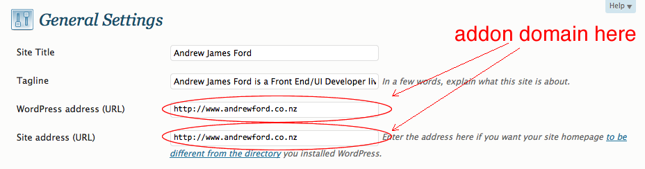

Just a few quick tips when setting up Wordpress using an addon domain on [HostPapa](http://www.hostpapa.com/).

When you've setup an addon domain for your HostPapa account following the [HostPapa Addon setup guide](http://hostpapasupport.com/index.php?_m=knowledgebase&amp;_a=viewarticle&amp;kbarticleid=18) and use the Fantastico script to install WordPress to your new subfolder you created for the addon domain.

This will setup your site and everything will appear just fine and will redirect you to your domain correctly. But if you check the source you'll see your files and links are being directed to your parent domain for your HostPapa account and then pointing to the subfolder you installed WordPress in e.g.

```
http://myoriginaldomain.com/myaddondomain.com/image.jpg
```

To stop this occurring simply go to the settings tab in the Wordpress admin for your new site and update the Wordpress address (URL) and the Site address (URL) like in the screenshot below.

