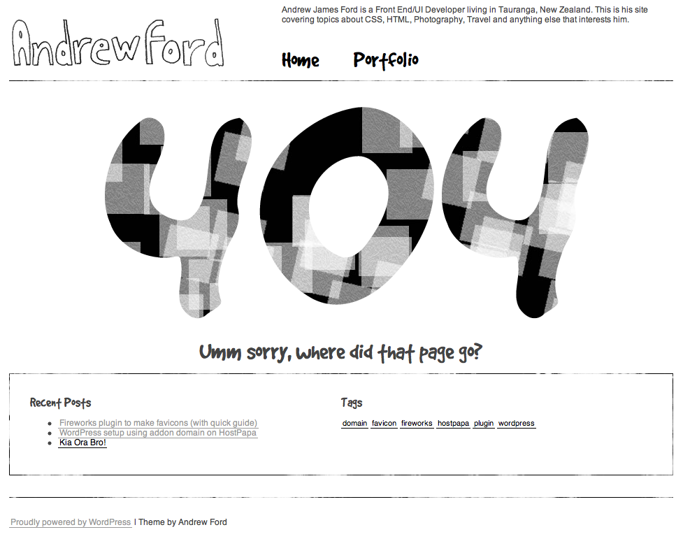

Saw a great article on .Net magazines site on how to create a [404 page with CSS 3 animation](http://www.netmagazine.com/tutorials/create-404-page-css3-animations) for browsers that support it. At the moment both Firefox 5 and Chrome support CSS3 animation (works on iPhone/iPad too), this will be great workaround for flash for simple banner ads. No more resorting to animated gifs.

So I had to make my own 404 page with the animation implemented. Check it out [here](http://www.andrewford.co.nz/error). (Please note this was for the old theme).

At the moment it can only be implemented with vendor prefixed properties. Setting an animation name and setting a key frame. For a great guide on how to do it all check out the article on [.Net magazine](http://www.netmagazine.com/tutorials/create-404-page-css3-animations).

&nbsp;
