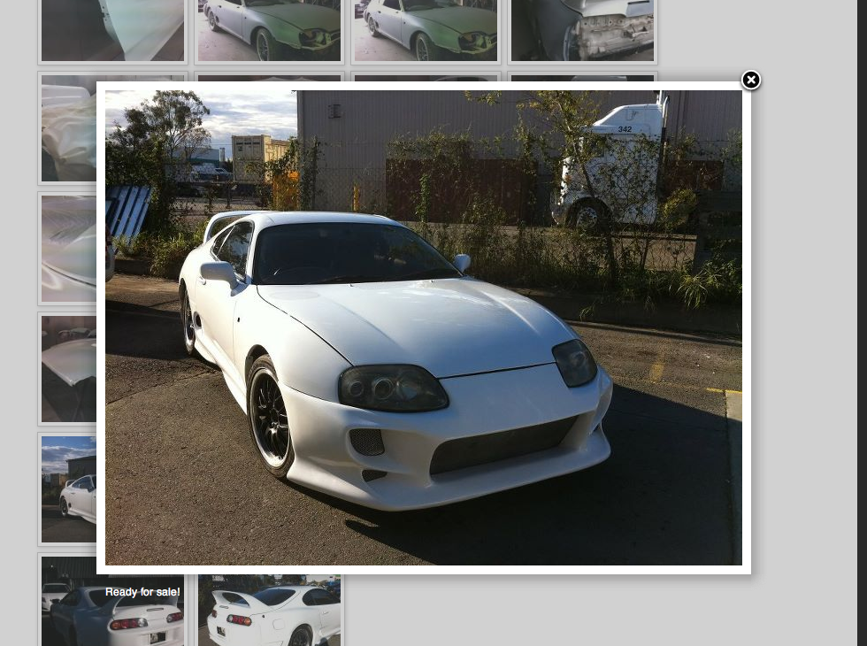

I recently built a Wordpress site for some friends. Being very busy people they were struggling to use the sites theme for galleries (I was struggling too with it). Being iPhone users they had no problem uploading photos of their clients cars to their business Facebook Page.

To help them out and get their galleries on display on their new website I used a great plugin for Wordpress called Facebook Page Photo Gallery. It allows you to add galleries from Facebook Pages with a simple short code on the page with the gallery ID. It formats the thumbs nicely and even opens the images in a 'fancy box' light box.

Great way to maximize the painful time consuming task of uploading images to your site.

Get the plugin from here:

[Wordpress Plugin page](http://wordpress.org/extend/plugins/facebook-page-photo-gallery/)

[Developers Plugin Page](http://zoxion.com/facebook-page-photo-gallery/)
