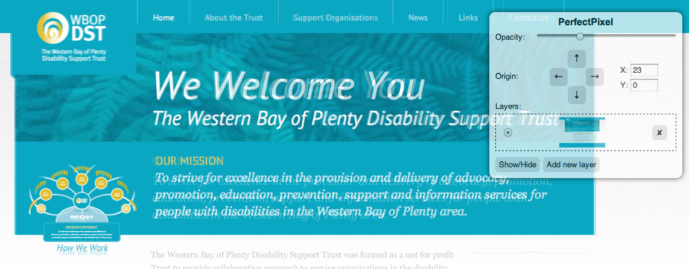

Ever had to build a web page for a picky web designer? One that will rake you over the coals for little things not matching their design?

I have plenty of times... To save all the frustration and make sure I get it right first time I use one of my favorite tools.

The tool I have depended on in the past is the great Firefox plugin Pixel Perfect. It allows you to overlay an image over top of the site your developing in the browser. This is great to make sure the page your styling matches the design.

If you use Google Chrome for development, there is a newly developed extension called Perfect Pixel. This has a lot of the same functionality as Pixel Perfect. Great if you've moved from Firefox to Chrome for developing like myself.

Try it out for yourself and you will quickly see how close (or far) you are from making the site your working on matches the design.

[Pixel Perfect for Mozilla Firefox](https://addons.mozilla.org/en-US/firefox/addon/pixel-perfect/)

[Perfect Pixel for Google Chrome](https://chrome.google.com/webstore/detail/dkaagdgjmgdmbnecmcefdhjekcoceebi)
