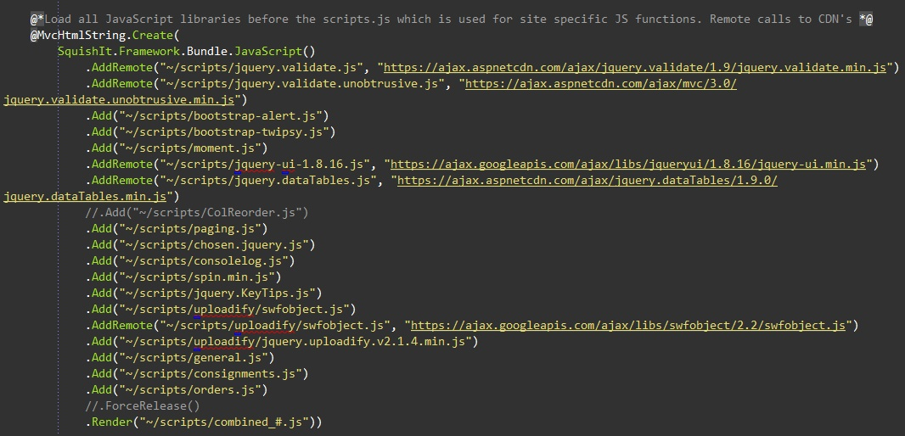

Over 6 months ago I started using LESS CSS, a dynamic language that adds the missing elements that CSS needs like variables and functions. I have to say I don't think I'll ever go back to standard CSS again, even for a static HTML site. The benefits of using LESS are just too great. The LESS CSS site can explain it better than I, check out the [examples and explanations](http://lesscss.org/) for a great intro.

The benefits of being able to quickly change the colour scheme by replacing a few variables, add cross browser vendor prefixed CSS in one line and to quickly create grids tailored to your project far out weigh the portability of standard CSS.

There are other dynamic CSS languages like SASS and Stylus to name a few. My experience so far has only be of LESS, I can't comment if one is better than the other. I recommend you research which you prefer for yourself. The reason I settled on LESS was right from the beginning it has been platform independent with many ways of implementing regardless of platform (OSX, Windows or Linux) and the other factor of it being very close in syntax to standard CSS.

To use LESS the files need to be processed to standard CSS to use in your web project. This can be done in a multitude of ways:

- Via referencing a JavaScript file
- A library as part of a build process
- An application to process the LESS files independent of programming language
- Using a plugin in your IDE

## Using LESS.js to compile your LESS

I can't say I've ever used this method. I'm not sure if you could use it in development, as I believe it's not cross browser supported. For a guide in using the LESS.js file I'd recommend going to the [LESSCSS.org](http://lesscss.org) web site and following the [LESS guide here](http://lesscss.org/#-client-side-usage).

## Implementing LESS ASP.Net as part of your build process

In my day job I develop a web application using ASP.Net MVC 3. The way I implement LESS in ASP.Net is via using the package SquishIt. Grab it from the [NuGet Gallery](http://nuget.org/packages/SquishIt). The great thing about SquishIt is not only does it process your LESS files (plus CoffeeScript) it will minify, and combine the output (even in a cache busting way). It's implementation is also extremely easy (and it works with both MVC and WinForm projects). Check out the developer [Justin's guide](http://www.codethinked.com/squishit-the-friendly-aspnet-javascript-and-css-squisher) on implementing SquishIt

SquishIt can also be used to reference your JavaScript files both minifying and combining. It can reference external CDN files e.g. for jQuery etc and local files in the same call, using the local file for development and the external file when going live. It will compile you LESS files on save so all that is needed to see your changes in the browser when developing locally is a refresh.

## Using the plugin in Visual Studio 2010 Mindscape Web Workbench

There is a plugin for Visual Studio that will add support for LESS syntax and highlighting, it will also process your LESS files to CSS. This would seem to be a great way to get started using LESS in your project without the need for much setup, but unfortunately I can't recommend it. The plugin would grind my copy of Visual Studio to a halt, making it virtually impossible to develop at any speed. The other nail in the coffin is the manual need to configure and minify and combine your CSS which is an essential part of web development these days.

## Using an application to process LESS

By far the the easiest way to implement LESS processing regardless of platform is to use an application to convert the LESS files into CSS, either on save of the file or by manually clicking a process button. On a Mac there are a multitude of options but by far my favourite is the application CodeKit. It allows importing from other folders, processing of many other CSS dynamic languages and the minification and combining of files. Other applications of note are SimpLESS which is multi-platform, and LESS app for Mac by the same developer as CodeKit. If you are just starting out I'd recommend CodeKit to start with, it's easier to setup and independent of the language your developing on also it will notify you of errors when compiling the LESS to CSS. CodeKit isn't free but in my opinion is worth every cent.

## Getting Started quickly with LESS

To get started quickly with LESS you can start with some great frameworks so you won't need to write your own mixins. The rapid development kick starter Twitter's Bootstrap uses LESS and is a great learning tool to see what's achievable. I'd recommend checking out the nicely structured LESS files of Twitter Bootstrap. Other frameworks of mention are [Elements](http://lesselements.com/) and my own set of mixins [LESS Mixing](https://github.com/andrewjamesford/lessmixing).

## Further Reading

- [LESS CSS](http://lesscss.org)
- [Tuts+ Get into LESS](http://webdesign.tutsplus.com/tutorials/htmlcss-tutorials/get-into-less-the-programmable-stylesheet-language/)
- [Learn LESS](http://www.12devsofxmas.co.uk/2011/12/less/)
- [Apps on Mac for CSS pre-processing](http://mac.appstorm.net/roundups/internet-roundup/5-mac-apps-that-make-css-preprocessors-easier-to-use/)
- [Mindscape Web Workbench](http://www.mindscapehq.com/products/web-workbench)
- [SquishIt on github](https://github.com/jetheredge/SquishIt)