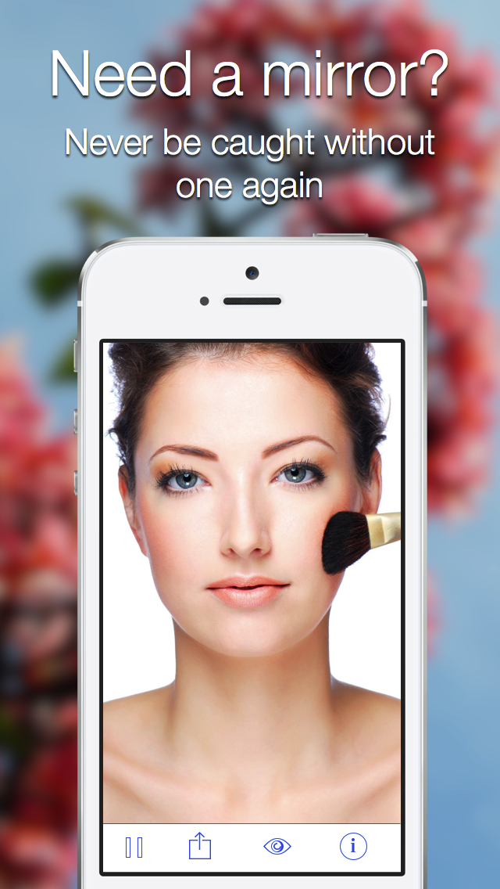

Unfortunately on the weekend my iOS app in review Mirror 7 was rejected. I won't go into the details, it was rejected with some pretty fair reasons and won't ever appear on iTunes.

Mirror 7 wasn't an amazing, knock your socks off app. It was what I believe was a well executed simple app to familiarise myself with iOS app development and deployment, implement a few cocoa pods and have some fun manipulating the input from the camera (zoom).

Rejection is hard, plain and simple. I spent more time than I want to tally up building this app as I was starting from scratch with Objective C and the iOS SDK. It was a hard slog at times, especially with a young family and a demanding full time job.

On the bright side I at least learnt some new skills and gained some appreciation of what is needed to make a great app for iOS.

So that others can learn from what I built,  I've open sourced the app on <a title="Github Mirror 7" href="https://github.com/andrewjamesford/Mirror7" target="_blank">GitHub</a> and for more details checkout the <a title="Mirror 7 by Taperiffic" href="http://taperiffic.com/mirror-7/" target="_blank">marketing site</a>. Feel free to <a title="Tweet me you comments or questions" href="https://twitter.com/andrewjamesford" target="_blank">tweet</a> me any questions or comments about the app and iOS development.