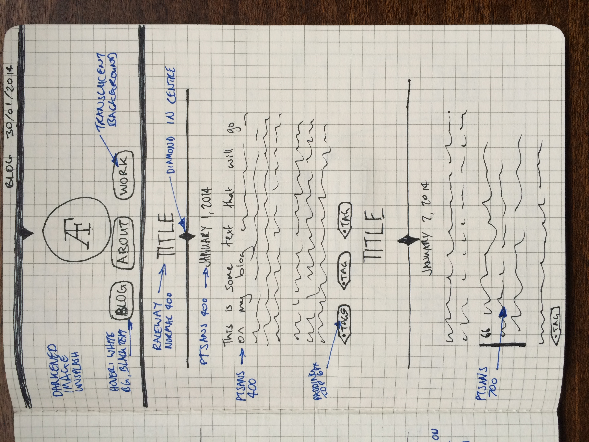

Today I launched the new look for my blog today. Seems it was just in time I got linked to from an article on the well known UK web design blog <a href="http://boagworld.com/design/why-codesign-tools-are-the-future-of-web-design/" title="Boagworld - Web & Digital Advice - 
why codesign tools are the future of web design">Boagworld</a>.

I've not gone for any radical change. Just tweaked what I'd already done. Added a new logo, rather than the old typeface. Placed a fixed splash image in the header and changed the heading font to be lighter, more in line with the logo.

Tell me what you think on <a href="https://twitter.com/andrewjamesford" title="Tweet me about the new design">Twitter</a>.