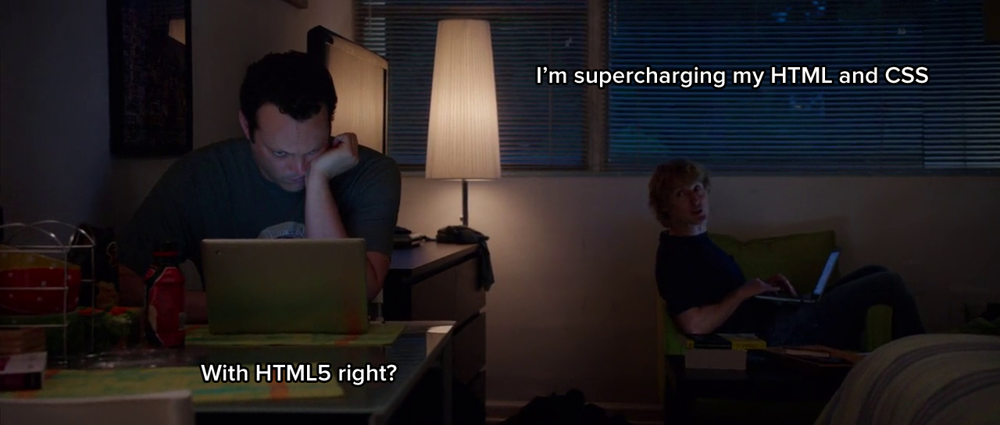
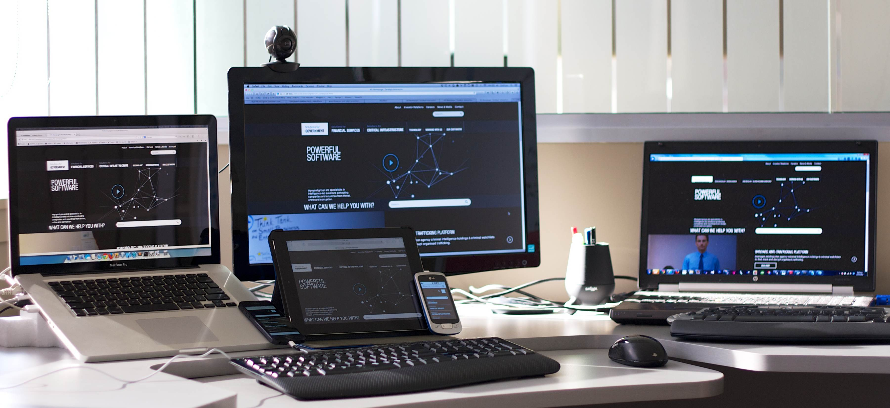
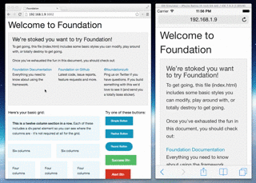

One of the biggest issues with Responsive Web Design development workflow is having to check as you build a website on multiple devices. Keeping browsers in sync between your devices wether they be desktop, tablet and phone (or simply Chrome vs. Internet Explorer) can be a time wasting experience having to manually refresh a multitude of devices. That isn't fun or productive.

A great way to speed up your workflow is to use a tool called <a title="BrowserSync: time saving synchronised browser testing" href="http://www.browsersync.io">BrowserSync</a>. It's platform independent, so will work on Windows, Mac and Linux. Requires Node JS and doesn't require you to do anything special (install an app or setup a proxy) on your mobile devices (tablets &amp; phones). Most importantly your site can be running as PHP, Rails or ASP.Net it doesn't matter.

The process is very easy to get up and running. After installing <a title="Node JS" href="http://nodejs.org">Node JS</a> it takes about 5 mins.

<strong>Step 1:</strong>
Download and install <a title="NodeJS" href="http://nodejs.org">NodeJS</a>

<strong>Step 2: </strong>
Install browsersync. Open a command line or terminal shell.

<code>npm install -g browser-sync</code>

This will install BrowserSync on your machine globally (allowing you to use it in any folder).

<strong>Step 3: </strong>
We will assume your using a web server on your local machine like MAMP or IIS. Go to the root folder of where your website is running and open a terminal/command line.

<strong>Step 4: </strong>
In the terminal window enter a similar command like this:

<code>browser-sync --proxy "mysite.local" --files "content/css/*.css, views/**/*.cshtml"</code>

This tells BrowserSync to run a proxy to the local domain of your website, and watch the CSS and HTML / Razor views of your website. For your own site replace the domain for the proxy with your own local address. Then change the paths to your files, in the case of running your site on PHP replace "cshtml" with "php".

When you run BrowserSync will fire up and open a new tab/window with an IP address &amp; port number that will proxy to your local address. Copy that IP address &amp; port number to other browsers and other devices to start syncing. Click around your site, scroll and make changes to your CSS to have the changes reflected across them all.

Now you have a fast way to quickly check changes across a multitude of devices as you build responsive web sites.