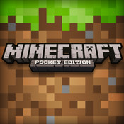
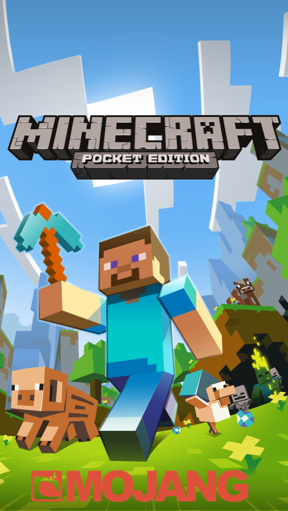

[Minecraft](https://minecraft.net) is a big hit with my family. My kids and I play together on the [Pocket edition](https://itunes.apple.com/nz/app/minecraft-pocket-edition/id479516143?mt=8&uo=4&at=10lnRx) creating all sorts of buildings. It keeps us entertained for hours, and hours. It’s the one game I don’t mind the kids spending all that time (([Why parents love Minecraft - The Verge](http://www.theverge.com/2014/9/15/6152085/why-parents-love-minecraft))) as I see it no different to the hours I spent playing with Lego as a child.

[Microsoft](http://microsoft.com)</a> buying Minecraft for [$2.5 billion](http://www.microsoft.com/en-us/news/press/2014/sept14/09-15news.aspx) might seem like a strange deal to some but let’s face it who would have the capital to buy the 3rd biggest game (([Best selling games across all platforms - Wikipedia](http://en.wikipedia.org/wiki/List_of_best-selling_video_games#All_platforms))) of all time and further build it. More importantly the new Microsoft are starting to embrace the benefits of going multi-platform with Office applications for iPad ([Word](https://itunes.apple.com/nz/app/microsoft-word-for-ipad/id586447913?mt=8&uo=4&at=10lnRx), [Excel](https://itunes.apple.com/nz/app/microsoft-excel-for-ipad/id586683407?mt=8&uo=4&at=10lnRx) and [Powerpoint](https://itunes.apple.com/nz/app/microsoft-powerpoint-for-ipad/id586449534?mt=8&uo=4&at=10lnRx)) and the soon to be released [Office for Android](http://www.theverge.com/2014/7/2/5863717/microsoft-office-android-tablets-beta) suite. I’m not worried that they will make it a Windows Phone or Xbox exclusive, there is too much money to turn down.

I’m excited to see where Microsoft can take Minecraft into the future with their cloud services (([Xbox Live Compute](http://news.xbox.com/2013/10/xbox-one-cloud) and [Azure](http://azure.microsoft.com/en-us/))) expertise.
