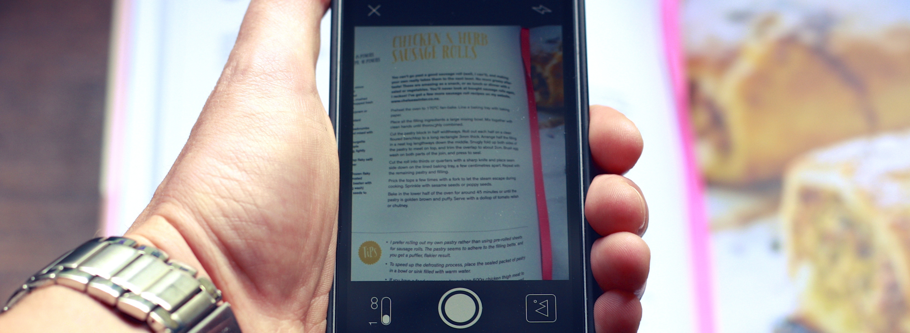

[Scanbot](https://itunes.apple.com/nz/app/scanbot-pdf-scanner-qr-reader/id834854351?mt=8&uo=4&at=10lnRx) my favourite document scanning app has been named the best over at [The Sweet Setup](http://thesweetsetup.com/apps/best-scanning-app-ios/).

Why I like Scanbot the most of all the great scanning apps out there is it's ability to quickly scan multiple documents with great results. You don't even need to press the shutter button it will automatically take the shot when the positioning is correct.

I use it all the time to save receipts for work, as I can scan them right there and then. Never losing one for an expense claim.

