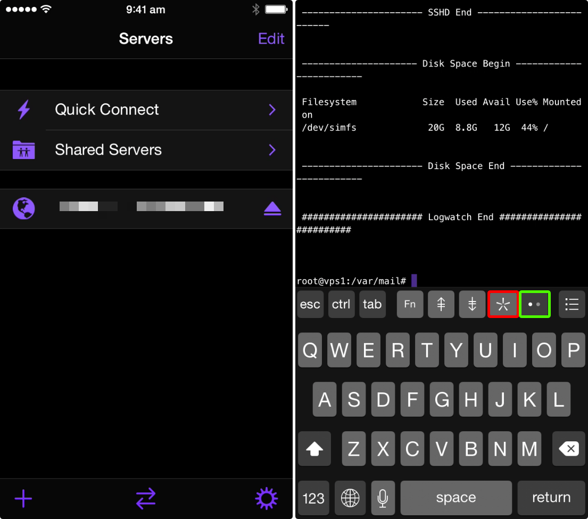
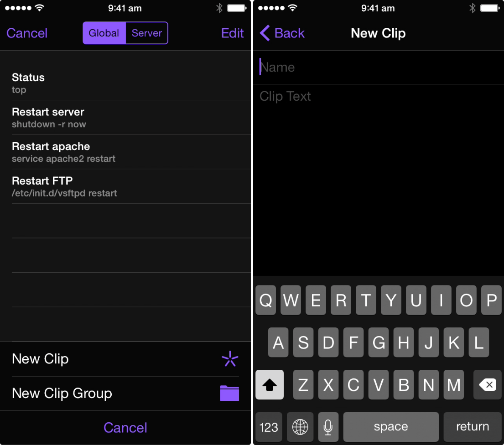

[Prompt 2](https://itunes.apple.com/nz/app/prompt-2/id917437289?mt=8&amp;uo=4) is an update to my favourite [SSH](https://en.wikipedia.org/wiki/Secure_Shell)</a> terminal app for iOS. It allows me to manage, perform maintenance and repair my [VPS](https://clientarea.ramnode.com)</a> (which hosts this website) from my phone anywhere I have an internet connection.

One of the new features added to the app are "clips", short snippets of commands you can create and sync between devices.&nbsp;This is great for saving time typing out complicated commands when your most likely under some pressure.



Once you've logged on to your session with your server tap the double dot button (shown in green in the screenshot above) until the star 5 pointed star button (highlighted in red) is shown then tap this to bring up the clips menu. You can create server specific or global clips.



Here are a few of the clips I use to manage my own server:

```top```

Used to show the top processes on the server and how much resources are used/free.

```shutdown -r now```

Will restart the server immediately.

```service apache2 restart```

Will restart apache2 web server.

```/etc/init.d/vsftpd restart```

Will restart the FTP service.

```
cd /var/log/apache2/
cat error.log
```
Will open your error log.

```
cd /var/mail
cat username
```

Will open mail for the username provided.

**Quick Tip:** If you add a new line this will force a return, running the command.

If you have any others you would like to share please tweet me [@andrewjamesford](https://twitter.com/AndrewJamesFord) or email me at andrewford dot co dot nz and I'll update the post.

Prompt 2 is well worth the upgrade for this feature alone. Combined with the [Panic's sync](http://panic.com/sync/) service your clips and servers will remain in sync across your iPhone and iPad. If your already using Prompt the import of your settings is seamless into Prompt 2.

Prompt 2 helps you manage your server from your iPhone any where you have an internet connection. It is available right now on the [app store](https://itunes.apple.com/nz/app/prompt-2/id917437289?mt=8&amp;uo=4)for NZ$12.99.