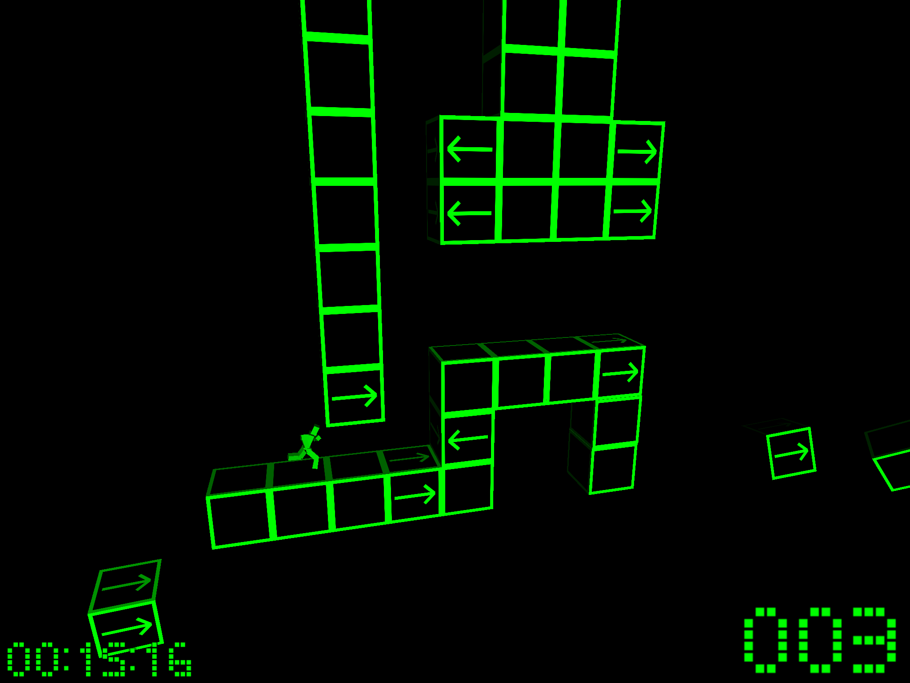

My friend [James](http://fingerbait.com) has recently released his new game for mobile [iOS](https://itunes.apple.com/nz/app/hardkour/id919039360?mt=8&amp;uo=4&amp;at=10lnRx) (both iPhone &amp; iPad), [Android](http://play.google.com/store/apps/details?id=com.fingerbait.hardkour) and [Windows Mobile](http://www.windowsphone.com/en-us/store/app/hardkour/dde22aa1-264c-4c7f-a0cb-282babf179ee)</a>. Its a great endless runner with a simple puzzle mechanic and [parkour](https://en.wikipedia.org/wiki/Parkour) influence. As your guy runs along a maze of green cubes some will have arrows pointing left and right. Make sure you have tapped the correct side, before your guy touches the arrow cubes or it's game over.

The game is extremely tough in the vein of flappy birds, but so addictive. Grab it now! The best thing is it's free.