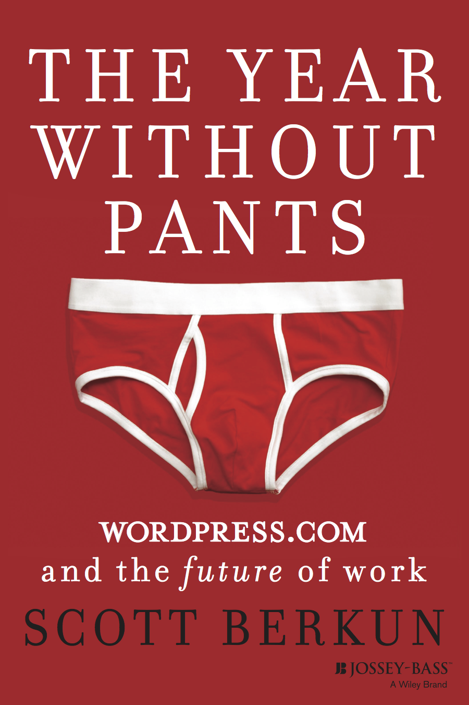

[Automattic](http://automattic.com) is the company behind the most popular blogging software in the world [Wordpress](https://kinsta.com/learn/wordpress-history/). In Scott’s book he describes how Automattic works from both a high level and directly in context of his own personal experiences being a team leader for Team Social on Wordpress.com.

He describes how the company is far removed from formal siloed practises like project management, agile, waterfall or even QA. Critiquing how different the organisation is to say Microsoft where he had worked for a number of years on the Internet Explorer team.

Automattic are different than most companies. They have a generally flat structure of hierarchy. The workers are all remote, scattered across the entire world, so the talent pool available to the company isn’t limited to one country or region. They do have a head office in San Francisco, but it’s rarely used. ((“We were told there was a whiteboard somewhere in the office, but it took a half-hour to find it, an indicator of how rarely the office was used.” Excerpt From: Scott Berkun. “The Year Without Pants.”))

If they have meetings they are either on Skype, or on IRC (I believe they have now moved (("Slack is an amazing chat tool for teams, we use it daily at Automattic" - [Lance Willett's blog](http://simpledream.net/2014/10/08/slow-slack/))) to using [Slack](https://slack.com). Every bit of work communication is expected to be out in the open on their P2 system (not surprisingly a Wordpress blog), rather than hidden in someones email inbox. Teams do meet in person multiple times a year. The company fly's them to a location somewhere in the world to all meet at (usually to finish/complete a feature set) as well as a the annual company meeting.

The company runs more like an open source ((“the culture of WordPress.com, a company of sixty people at the time, was highly autonomous and rooted in open source culture” Excerpt From: Scott Berkun. “The Year Without Pants.”)) project, with a list of features that need to be done and the teams simply tackling these features and “shipping” them to the public (releasing the software to wordpress.com). Teams seem to all pitch in to get everything done, unlike traditional companies where steps or processes are separated (i.e. project management, testing). Their results are all out in the open for everyone to see in the organisation. They still have meetings, they just tend to be on Skype or IRC.

I got a lot out of the book being a remote worker myself, now on my second remote job. Scott goes into great detail about his day-to-day running of his team that aren’t in the same room as he is. Explaining the isolation a remote worker can feel, reinforcing the need to over communicate when not in person, and extolling the virtues of face to face communication (and how we overlook all the nuances it affords) when you are in person.

This book is for anyone that wants to get a feeling of what a remote company can be like, how teams can co-operate across the world thanks to the Internet and for those that are curious about doing business a different way.
