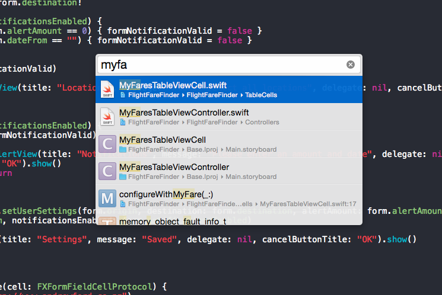

The guys at [Mobile Couch](http://mobilecouch.co/66) have a great collection of tips for mobile development including keyboard shortcuts and tools for deployment.

My favourite is "Open Quickly" in Xcode:
Command + Shift + O

