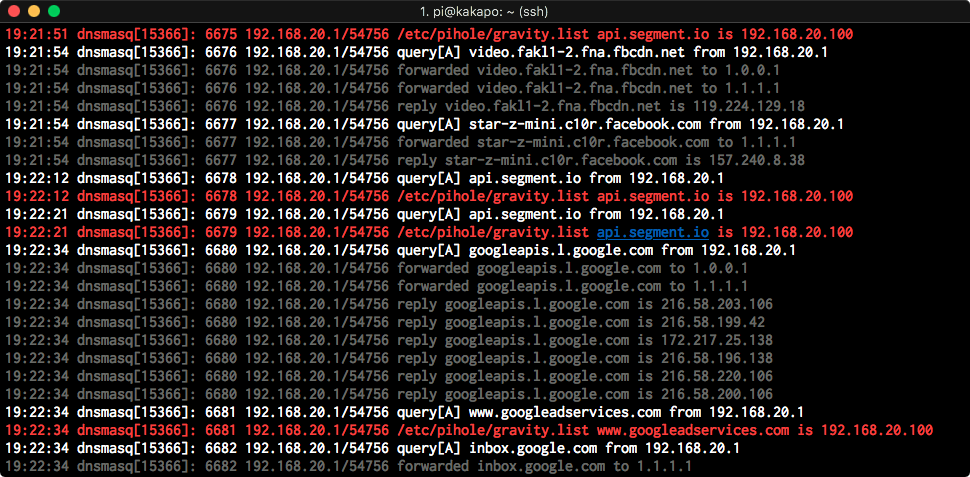

While having a [Pi-hole](https://pi-hole.net/) is great for blocking ad's and tracking, a downside is New Zealand doesn't get mentioned much in what URL's are needed to be 'whitelisted' so apps keep working.

The two big free to air TV companies have apps for mobile and TV boxes (like the Apple TV), and standard block lists seem to break these apps for [TVNZ](https://www.tvnz.co.nz/shows) & [Threenow](https://www.threenow.co.nz/).

Here is my whitelist of URL's you will need to add for these apps to work.

- accounts.au1.gigya.com
- cdns.au1.gigya.com
- cdns.gigya.com
- edge.api.brightcove.com
- imasdk.googleapis.com
- metrics.brightcove.com
- socialize.au1.gigya.com

There are two ways to add these from the command line like this:

```
pihole -w url-to-whitelist.com
```

The other is from the `piholeipaddress/admin/list.php?l=white` interface on your network, and enter them one by one.

If you come across further issues I find the easiest way to see what other URLs need to be whitelisted is to open a terminal session to the Pi-hole and run:

```
pihole tail
```

This will output a real time stream of the DNS requests made on your network. White are allowed, red are being blocked. Try to play a video or audio stream for the app that is being effected and systematically whitelist urls until the app works as intended.


