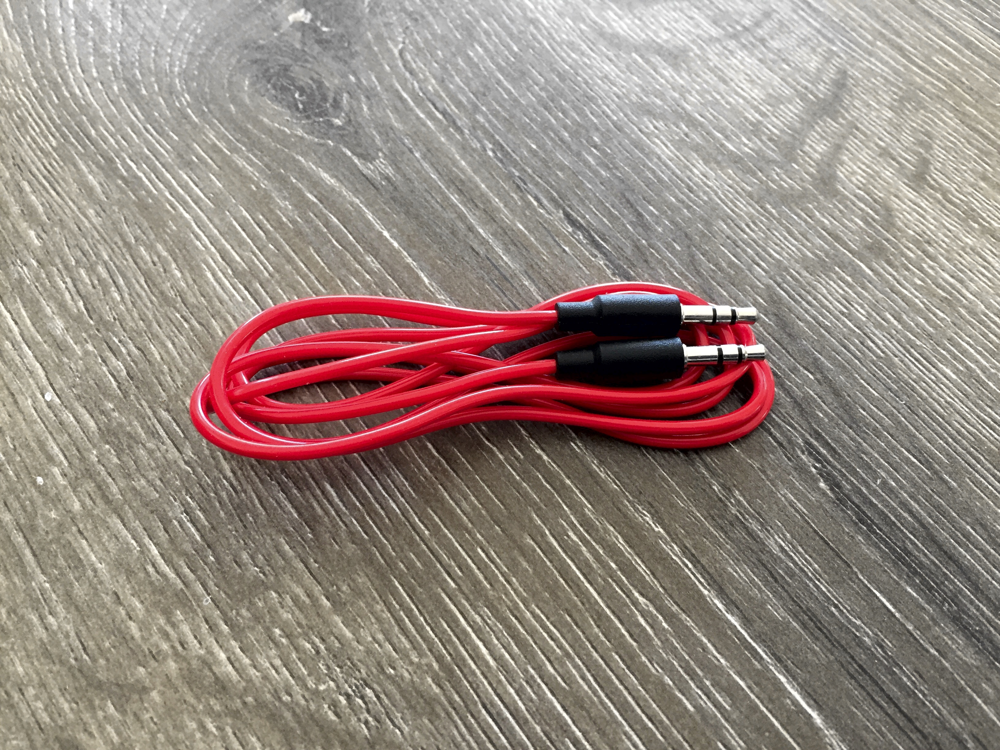
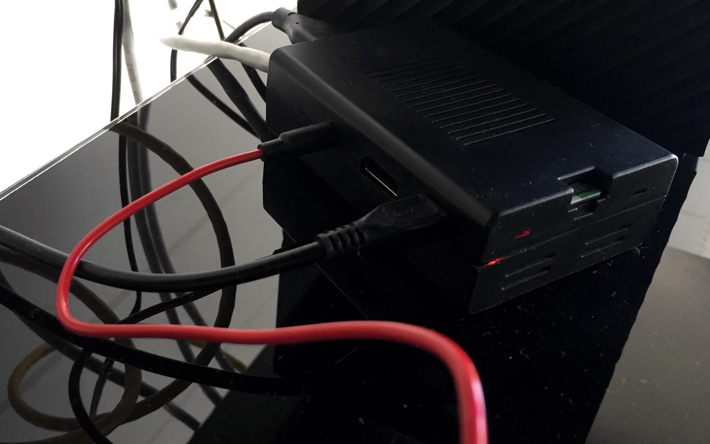
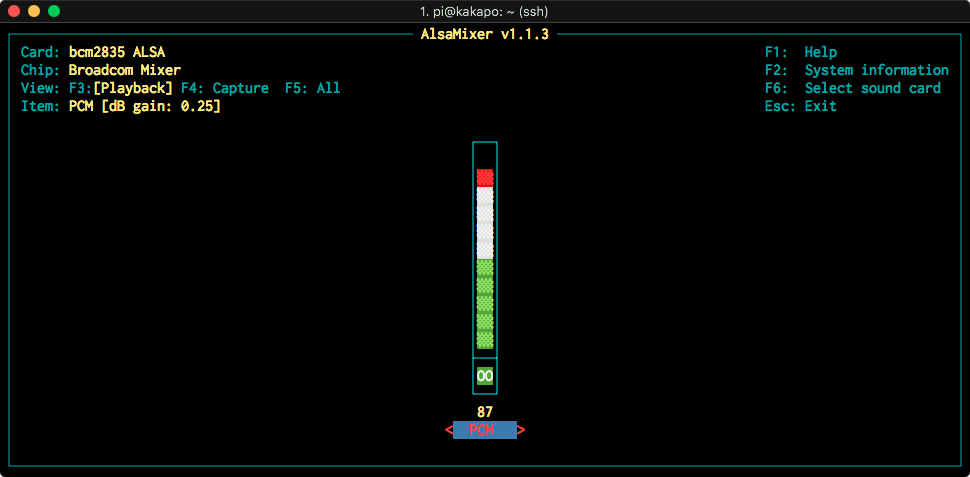

[Raspotify](https://github.com/dtcooper/raspotify) is a great package to install on a Raspberry Pi to turn it into a [Spotify Connect](https://www.spotify.com/nz/connect/) client that just works.



All your going to need is a:

* Speaker with a 3.5mm stereo input
* 3.5mm stereo cable
* A Raspberry Pi that has a 3.5mm stereo jack



My Pi sits right next to the soundbar underneath the TV in our lounge, I installed a 3.5mm stereo cable plugged it in to the soundbar and the other end into the Pi. Installed the Raspotify package by SSHing into the Pi and running the [script](https://github.com/dtcooper/raspotify#tldr).

```bash
curl -sL https://dtcooper.github.io/raspotify/install.sh | sh
```

Once installed open up spotify on your computer or phone and connect to a device and select `Raspotify` and your now playing on your speaker. Raspotify acts as a Spotify client so data isn’t being pulled off your phone, and you can still take calls and not have them go through the speaker like if you were on Bluetooth. Your phone or computer acts like a remote instead, so you can switch apps or close the lid on your notebook PC while playing a playlist.


One issue I found was that Raspotify was too quiet and I had to turn the soundbar right up to hear, even with Spotify at maximum volume. To fix this on the raspberry pi run:

```
alsamixer
```

Press the `UP` arrow to turn up the volume on the Pi itself.


