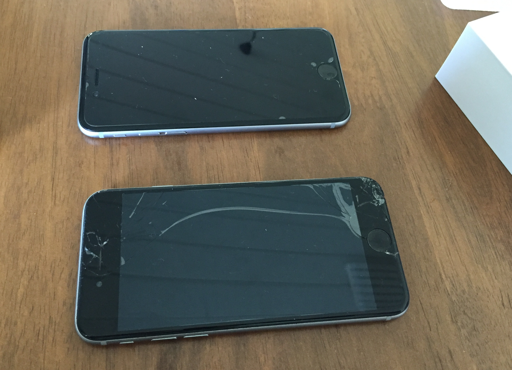
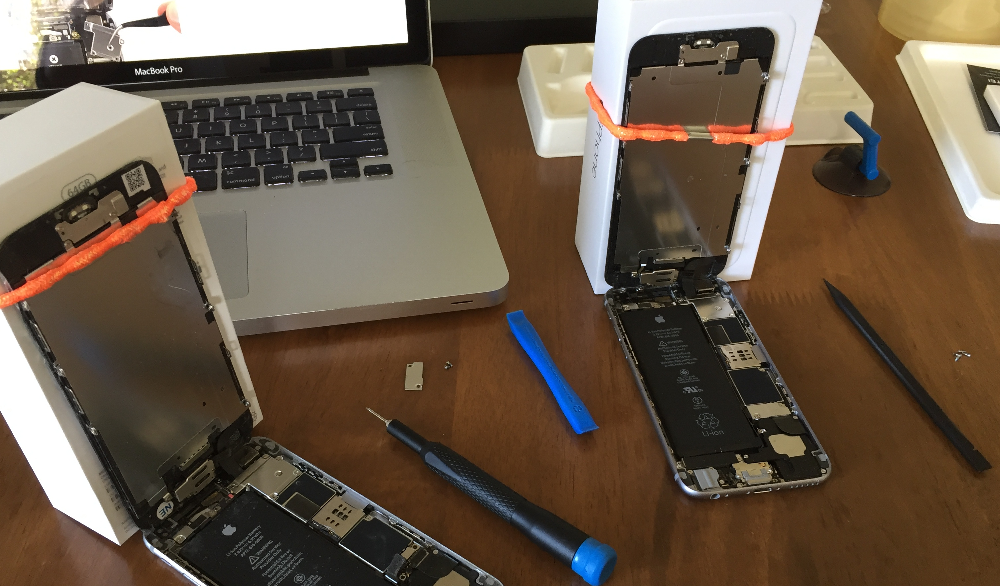

We've ended up with two iPhone 6 phones, one with a smashed screen the other water damaged (but it's screen pristine). As both are well out of warranty by this time, rather than pay for someone else to repair them I thought why not swap the good screen to the smashed one myself and while I'm at it replace the battery with a new one.

I bought a [battery replacement kit](https://www.ifixit.com/Store/iPhone/iPhone-6-Replacement-Battery/IF268-002-4) from [iFixit Australia](https://australia.ifixit.com/) for under $60 NZD. When the battery kit turned up I took both phones apart with the repair kit tools. Following the guide [here](https://www.ifixit.com/Guide/How+to+Replace+Your+iPhone+6+Battery/29363) I prised the phone apart and disconnected all the connectors carefully, replaced the battery and swapped the screens. In half an hour I had a working iPhone with a pristine screen.

The iFixit kit has almost everything you need to take apart and put the phone back together. It even comes with replacement screws to switch the bottom pentalobe ones to phillips and make it easier next time.
