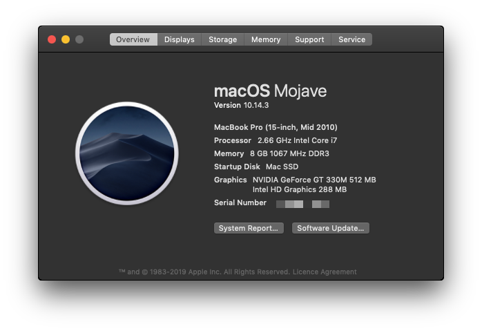

I still use a Mac Book Pro from 2010. It's been upgraded with more ram and an [SSD (which I covered here)](https://andrewford.co.nz/2016/03/27/extended-lease-of-life-for-old-macs/), as it's from a time when you could still upgrade a Mac yourself. Last year when [macOS Mojave (10.14)](https://www.apple.com/nz/macos/mojave/) was announced it became clear I would not be able to upgrade and be stuck on High Sierra.

Or so I thought... Thanks to the efforts of [**Dosdude1**](http://dosdude1.com/mojave/) you can patch the installer of Mojave and install on _some_ older hardware not supported by Apple which includes my 15" mid 2010 Mac Book Pro (MacBookPro6,2) with it's superior keyboard.

I did a fresh install by downloading the Mojave installer, patched and created a bootable USB drive following the [guide](http://dosdude1.com/mojave/). It was a painless process and the only difference between a normal install was the use of the patch tool.

If you have a MacBookPro6,2 which had some graphics card issues causing it to Kernel panic I recommend you also install this patch [here](https://github.com/fabioiop/MBP-2010-GPU-Panic-fix) too that supports Mojave.

Now I get to enjoy the new features of Mojave like **Dark Mode**, use the new snapshot tools and run the [Home app](https://www.imore.com/home-app).
