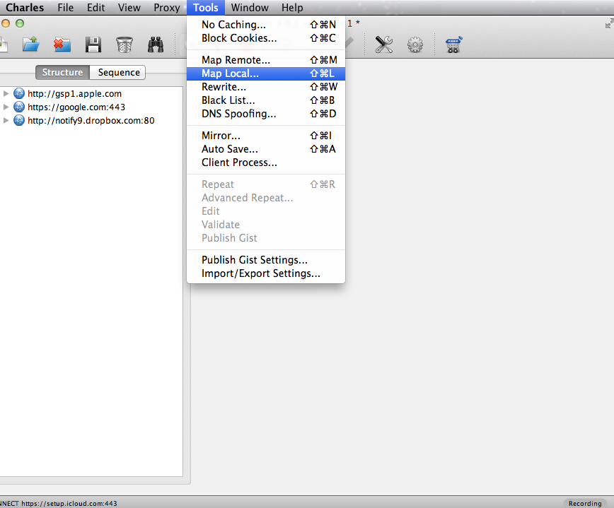
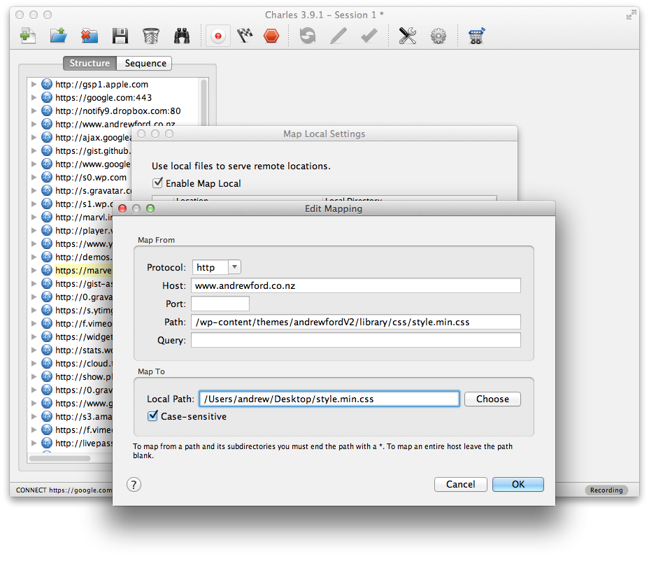

What if you could check/preview your CSS changes before you push your changes to your site? You can with <a href="http://charlesproxy.com" title="Charles proxy" target="_blank">Charles</a> proxy. Check out the video below from <a href="http://learnable.com" title="Learnable" target="_blank">Learnable.com</a>.

<iframe width="560" height="315" src="//www.youtube.com/embed/y8Okx-RWK3M" frameborder="0" allowfullscreen></iframe>

First enable local mapping. Under "Tools" > "Map Local".

Charles enable map local

Then select the CSS file you want to override with your local copy.

Too easy. When you next refresh your browser you will see the changes you made to your CSS. You now have a great way to double-check your changes before go live.

Have a good explore around all the features of <a href="http://charlesproxy.com" title="Charles proxy" target="_blank">Charles</a>, it's a great tool to have in your toolbox.