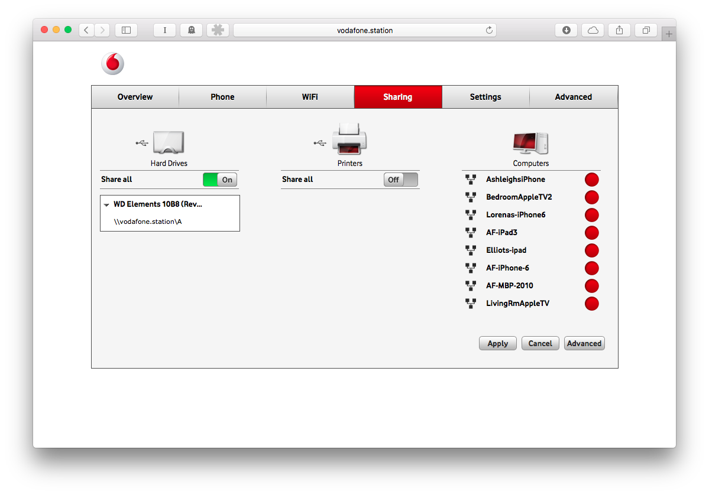
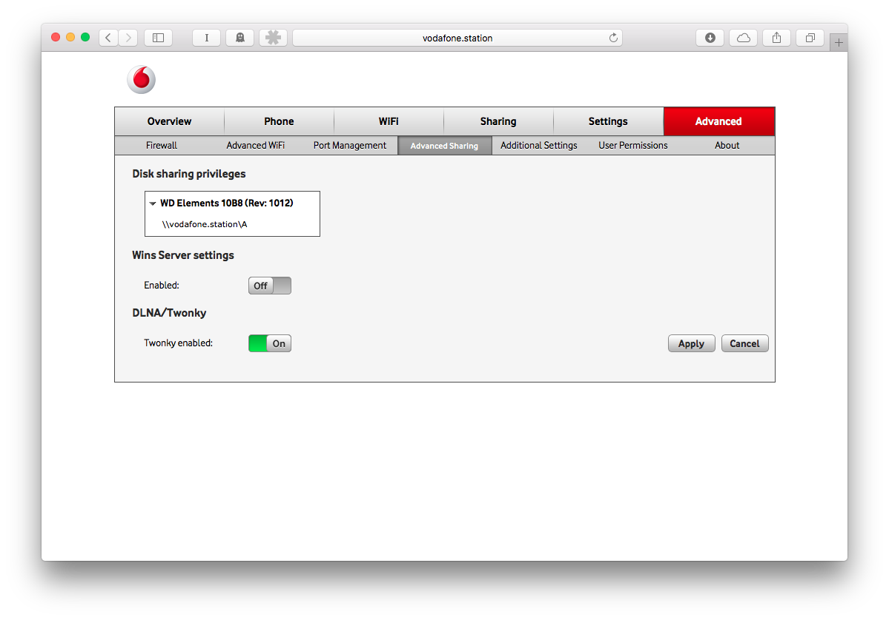
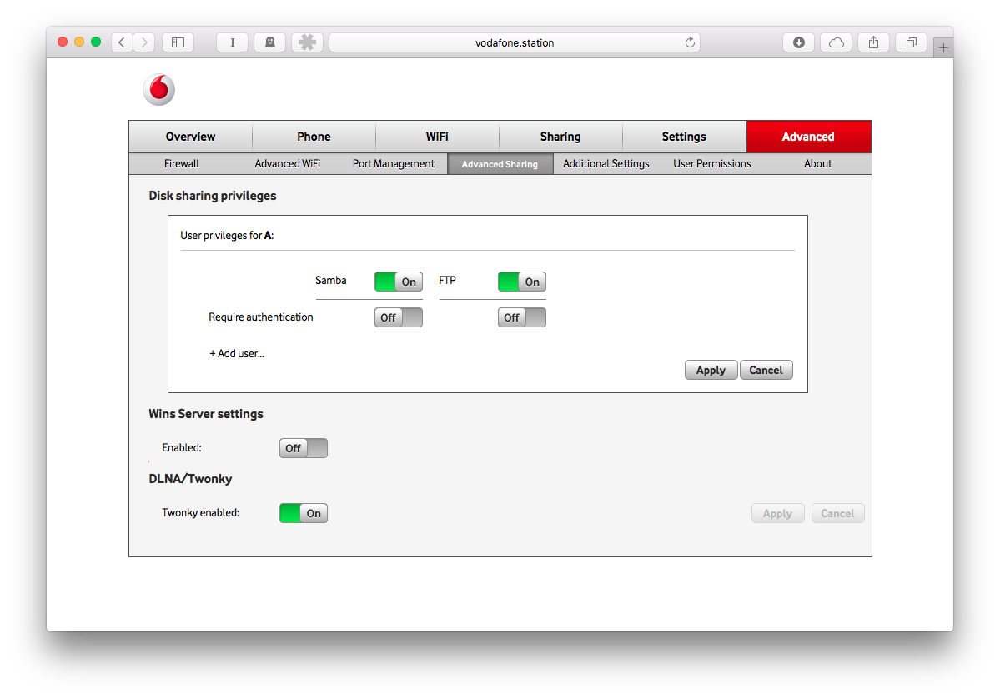

For a long time I've wanted a NAS (Networked Attached Storage) but put off buying one due to the cost. For those that don't know what a NAS is it is a small box that either plugs into your network/router via cable or wifi. It's a hard drive that you can access on your network to copy or read files to, very much like a shared folder in your office. Some can even download torrents or act as a email server.

>[Network Attached Server (NAS)](https://en.wikipedia.org/wiki/Network-attached_storage) is a file-level computer data storage server connected to a computer network providing data access to a heterogeneous group of clients.

With the move to only laptops and mobile devices in our house, more storage is always in high demand. But I don't want to manage another computer just to serve files.

So after being fed up with my [Plex](http://plex.tv) server needing a restart again as the old laptop it lived on is getting pretty creaky, I thought there must be a better way to manage media on our home network. Then it clicked, the router we've had for quite some time has the abilty to act as a basic NAS.

>**Plex** organizes video, music and photos from personal media libraries and streams them to [smart TVs](https://en.wikipedia.org/wiki/Smart_TV), [streaming boxes](https://en.wikipedia.org/wiki/Digital_media_player) and [mobile devices](https://en.wikipedia.org/wiki/Mobile_device). It is a [media player](https://en.wikipedia.org/wiki/Media_player_(software)) system and software suite consisting of many player applications for [10-foot user interfaces](https://en.wikipedia.org/wiki/10-foot_user_interface) and an associated [media server](https://en.wikipedia.org/wiki/Media_server) that organizes personal media stored on local devices.

### Setup

When we switched to [Vodafone](http://www.vodafone.co.nz) they supplied a smart looking router in white with a LCD screen called a Vodafone Station. It has two USB ports and supports up to a 2 TB hard drive (which luckily I had previously attached to the old Plex server PC). I simply plugged it in to the router and fired up the [settings page](http://vodafone.station).

Go to the **Sharing** tab and make sure the **Share All** switch is green. If you click the downward facing arrow with the name of the Hard Drive it will show you the SMB share path. Now if you jump on your Mac from the **Finder menu > Go > Connect to Server** option you can type in the address shown. On a Windows machine open an explorer window and simply type address in.

So now you can connect to the drive and see it's existing media and should be able to view, copy, delete and upload files to the NAS disk. To further make your NAS available by other servers I recommend you enable FTP as well.

FTP settings are located in the **Advanced > Advanced Sharing** tab. The FTP swith is hidden. To find it click on the downward arrow by the disk name and then click on the disk location path e.g. **\vodafone.station\a** This will show the User priveliges pane where you can enable the FTP setting. So how do we access our media?

### Playing Video

[Infuse](https://firecore.com/infuse) is the player to use if you have iOS devices. Its a great standalone video player that can access shared folders (SMB) on a NAS, grab the metadata and play on device or via Airplay/Chromecast (if you upgrade to the pro version) on your TV. Version 4 has just be released for the new Apple TV app store and can access the shared files directly on your NAS, no need to Airplay. If you don't have a new Apple TV you can still Airplay to older versions (or to a Google Chromecast).

### Backing up Photos

I quickly took up Google Photos when it was released and haven't looked back for my online photo storage (previously I'd used [Flickr](https://www.flickr.com). Having access to your entire collection of photos for free with great search is pretty amazing. But there is one downside on the free tier, your photos are compressed (not that you can tell) but none the less you can't download the proper originals.

So they say you should always have at least two backups, but how without having to sync your phone? Simple use CameraSync on iOS. It doesn't support SMB shares but it does support FTP which is pretty easy to setup. I have mine set to backup when on wifi when I'm at home (thanks to the background location sync).

### Conclusion

So for a pretty minimal outlay in cost for an external hard drive and if your lucky enough to have a router that supports it you too can have a home NAS. For further functionality of the Vodafone Station grab the [manual](http://help.vodafone.co.nz/ci/fattach/get/1081671/1377227070/redirect/1/filename/vodafone-station-complete-user-manual.pdf).