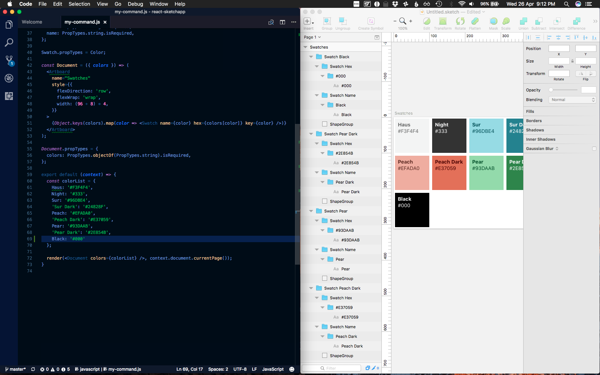

Two great tools I like to use are React.js and Sketch.app now just got better together with AirBnB's new open source library <a href="https://github.com/airbnb/react-sketchapp" target="_blank">React-Sketchapp</a>. It can render your React components to a Sketch design file. 

Traditionally your application is designed in a UI design tool like Sketch. From the mockups the developers/designers create the React components based on these designs. Over time these move away from the original Sketch file with revisions over the life of the project/product. The design files need to be updated manually and this can be very time consuming.

But now you can use React-Sketchapp to generate the design files from the actual React components that are used in your application. 

When you need to create a new design or modification of a component your Sketch files will be up to date with the latest version of your existing components.

Another cool side effect is you can use data in your designs.

Check out Jon Gold's article on ["Painting with Code"](http://airbnb.design/painting-with-code) and then jump in to the [quick start guide on github](https://github.com/airbnb/react-sketchapp#quickstart).

