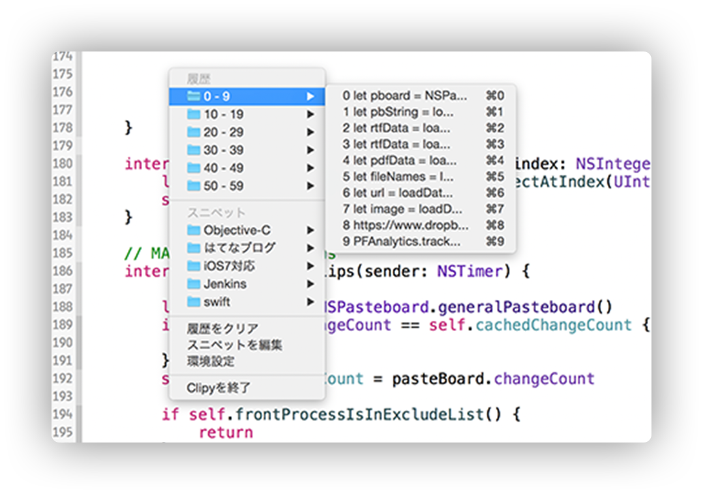

Was really happy to find a replacement for the now unsupported clipboard manager [Clipmenu](http://www.clipmenu.com/) today. 

It's called [Clipy](https://clipy-app.com/) and acts just the same as [Clipmenu](http://www.clipmenu.com/) but has a new snippet manager. What I found set both Clipmenu and Clipy apart when compared to other clipboard menu managers was the when you activated it via keyboard shortcut it would be right next to the cursor so you don't have to shift your focus away from what you are doing to select the item you want to paste into your document.

