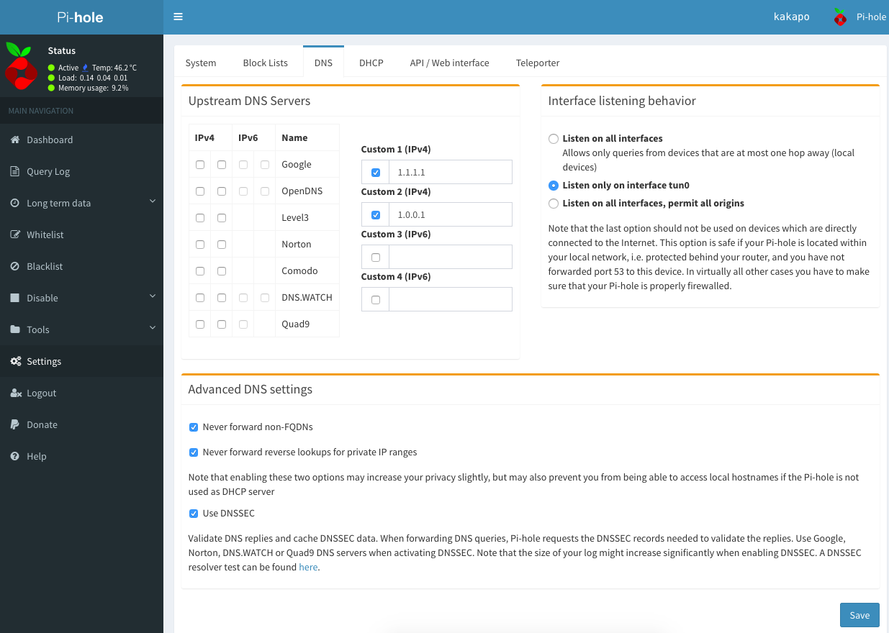

[CloudFlare](https://blog.cloudflare.com/announcing-1111/) announced today the fastest privacy focused consumer DNS. Which is great news for those that are privacy conscious. DNS is like the directory for the internet, every request you make for a domain like [www.duckduckgo.com](https://duckduckgo.com/) is more than likely tracked via your ISP regardless if the URL is HTTPS. CloudFlare are now offering their own DNS that doesn't store any information on it's users.

I use a [Pi-hole](https://pi-hole.net/) ad-blocker/tracking-blocker server on my [Raspberry Pi](https://www.raspberrypi.org/) that blocks advertisements (that track you) network wide at home. To start using CloudFlares DNS server simply add a custom IP to the DNS section of 1.1.1.1 and 1.0.0.1 for redundancy. You can do the same on your router or PC & Mobile.

Not only will your requests be faster, you can feel a little more at ease that you aren't being tracked by your ISP. With the [Mozilla](https://mozilla.org) foundation (creators of Firefox) they have also added support for DNS HTTPS.

For more details:

- [1.1.1.1](https://1.1.1.1/)
- Cloudflare Blog - [Introducing DNS Resolver, 1.1.1.1](https://blog.cloudflare.com/dns-resolver-1-1-1-1/)
- Cloudflare Blog - [Announcing 1.1.1.1: the fastest, privacy-first consumer DNS service](https://blog.cloudflare.com/announcing-1111/)
- Fast Company - [Here’s How To Plug One Of The Biggest Privacy Holes In The Internet](https://www.fastcompany.com/40551457/heres-how-to-plug-one-of-the-biggest-privacy-holes-in-the-internet)
- TechCrunch - [Cloudflare’s new ‘privacy-focused’ DNS service speeds up your web browsing](https://techcrunch.com/2018/04/01/cloudflares-new-privacy-focused-dns-service-speeds-up-your-web-browsing/)
- The Verge - [Cloudflare launches 1.1.1.1 DNS service that will speed up your internet](https://www.theverge.com/2018/4/1/17185732/cloudflare-dns-service-1-1-1-1)
- Engadget - [Cloudflare makes it harder for ISPs to track your web history](https://www.engadget.com/2018/04/01/cloudflare-1111-dns-privacy-service/)
- Cnet - [This new privacy tool would speed up your internet, too](https://www.cnet.com/news/cloudfare-new-1111-dns-privacy-tool-would-speed-your-internet-too/)
