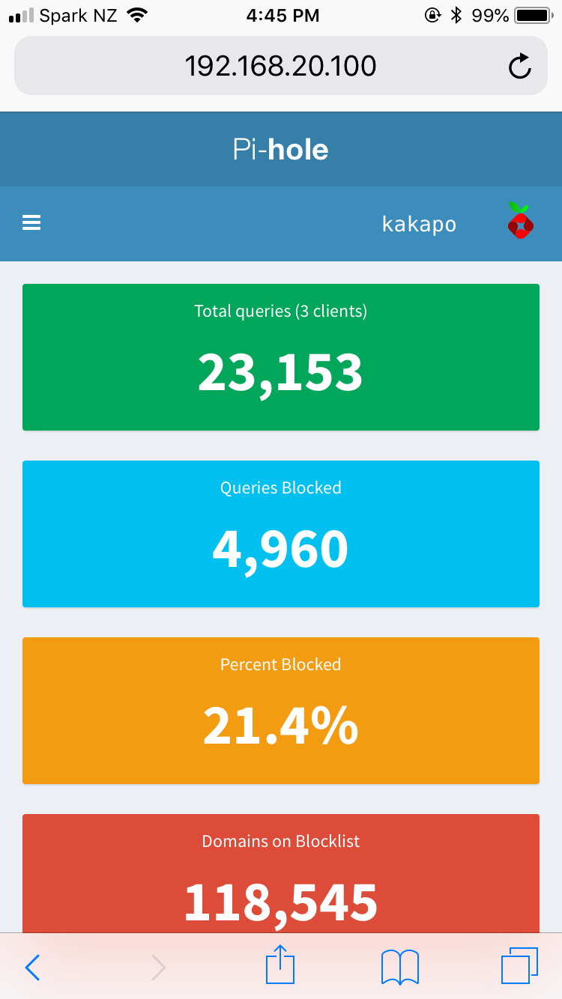
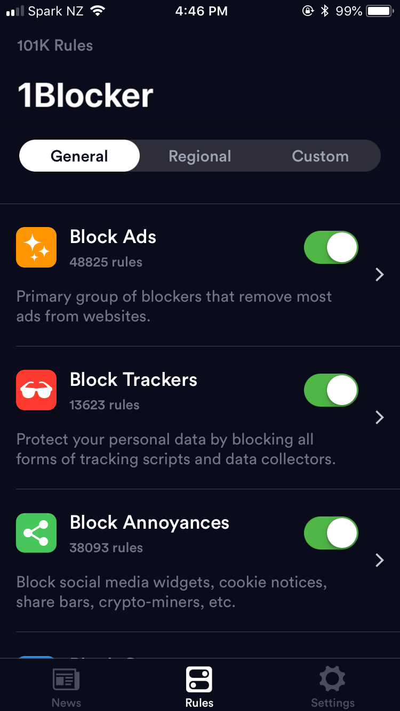

I detest the majority of advertisements, as they more than often have little context to me. The ad driven model of baiting for clicks is breaking the internet. It’s causing tech & advertising companies to do [creepy stuff](https://motherboard.vice.com/en_us/article/bjb745/john-oliver-facebook-ads-last-week-tonight) and just [be evil](https://www.nasdaq.com/article/googles-china-reentry-plan-looks-evil-and-risky-20180802-00012). It’s making media companies produce [meaningless content](https://www.buzzfeed.com/) that is meant to fire you up until the next rage inducing article. Luckily you can do something about it to reduce the surveillance at home.

First line of defence is setting up [Pi-hole](https://pi-hole.net/) on your network. This will block ads before they even get to your devices. Not only that it will also block tracking to **all devices** on your network. You can install it on all manner of machines, but one of the cheapest is a Raspberry Pi.

_Pi-hole Dashboard_

Did you know that most apps you install on your devices will have tracking and telemetry sent to the likes of Segment, Crashlytics or Mix Panel unfortunately you generally can’t opt out of this.
To stop this sort of tracking the default block lists on the Pi-hole are a good place to start. If you wish to automatically block other content look into [Steven Blacks hosts lists](https://github.com/StevenBlack/hosts). He has lists for almost everything on his Github page.

Once you have the network protected it’s time to turn your attention to the client devices. For desktop browsers I recommend [Firefox](https://www.mozilla.org/en-US/firefox/new/) or [Chrome](https://www.google.com/chrome/index.html) with the following add ons

* UBlock Origin - [Chrome](https://chrome.google.com/webstore/detail/ublock-origin/cjpalhdlnbpafiamejdnhcphjbkeiagm), [Firefox](https://addons.mozilla.org/en-US/firefox/addon/ublock-origin/)
* Privacy Badger - [Chrome](https://chrome.google.com/webstore/detail/privacy-badger/pkehgijcmpdhfbdbbnkijodmdjhbjlgp), [Firefox](https://addons.mozilla.org/en-US/firefox/addon/privacy-badger17/)
* HTTPS Everywhere - [Chrome](https://chrome.google.com/webstore/detail/https-everywhere/gcbommkclmclpchllfjekcdonpmejbdp), [Firefox](https://addons.mozilla.org/en-US/firefox/addon/https-everywhere/)
* Canvas Blocker - [Firefox](https://addons.mozilla.org/en-US/firefox/addon/canvasblocker/)
* Decentraleyes - [Firefox](https://addons.mozilla.org/en-US/firefox/addon/decentraleyes/)

For iOS I recommend installing a ["Safari content blocker"](https://www.macworld.com/article/2984483/ios/hands-on-with-content-blocking-safari-extensions-in-ios-9.html). This is an ad blocker that unfortunately will only work with Safari. For a free option [Firefox Focus](https://support.mozilla.org/en-US/kb/focus) is a good start.

On the high end with lots of configuration options [1Blocker X](https://1blocker.com/) is great, and my favourite. I love it's standout feature that allows custom blocking of elements (helpful for blocking popups or those download our app messages).

_1Blocker X - that's right 101k rules_

Installing these items in your home will go a long way to reducing the number of ads you will have to see day to day in your household.
