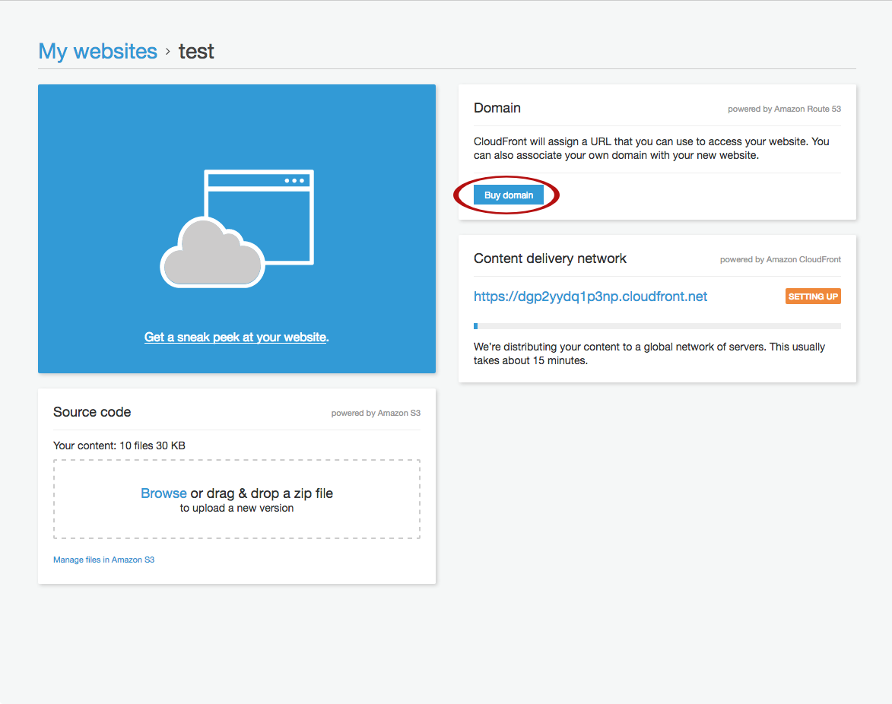
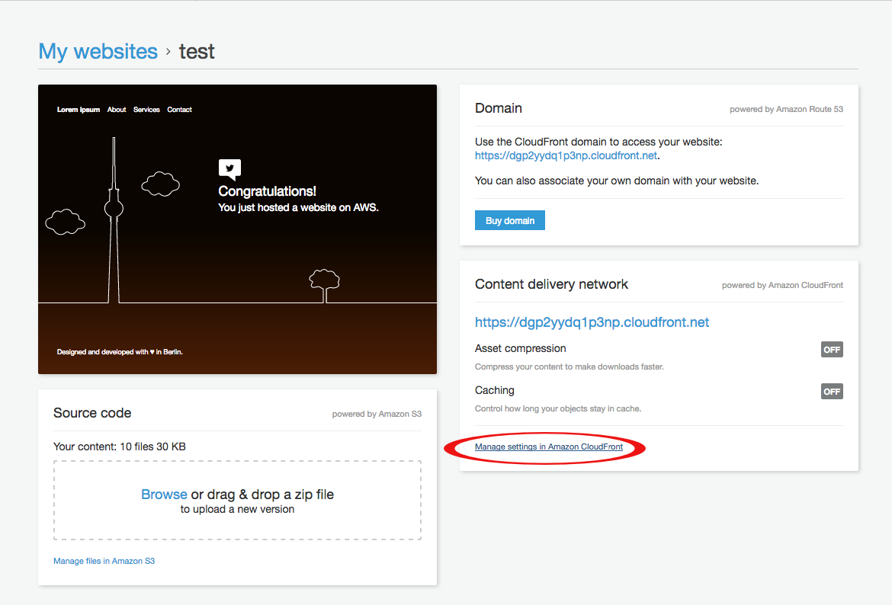

Hosting a static website (static as in HTML/CSS files and JavaScript, not PHP, C# etc) on AWS can seem like a bit of a mine field at first. But it really isn't, as AWS have a great wizard like tool that does everything you need to get going quickly.


Tucked away on the AWS documentation is a link to the [Website Quickstart Hosting](https://console.aws.amazon.com/quickstart-website/home) page (this requires an Amazon developer account). From here its made as easy as possible to get your own static site setup on AWS using [S3](https://aws.amazon.com/s3/) for file storage, [CloudFront](https://aws.amazon.com/cloudfront/) as the CDN for your sites content to be cached on, [Route 53](https://aws.amazon.com/route53/) where your domain or sub-domain is configured, with [AWS Certificate Manager](https://aws.amazon.com/certificate-manager/) ready for securing your site over HTTPS.

The quick start wizard makes this as easy as giving your project a name and uploading a zip file with your content (make sure it has an `index.html` file). It abstracts away all the manual steps you'd have to complete to have your site running. But it's still possible to get to the individual products (like [CloudFront](https://console.aws.amazon.com/cloudfront/home), [S3](https://s3.console.aws.amazon.com/s3/home)) and tweak settings from the individual sections in the AWS Console. By default your site will be accessible via HTTPS on a cloud front domain.

## Adding your own domain



Once you have uploaded your content to AWS you will be taken to the screen above. Click on the `Buy domain` blue button and you can either buy a domain direct from Amazon or use an existing domain (the catch is you will need to be using [Route 53](https://console.aws.amazon.com/route53/home) as your Name Server to be able to use it).

## Adding SSL

Now you have your domain setup against your public site, it's time to make it secure (for performance mainly when using [HTTP/2](https://en.wikipedia.org/wiki/HTTP/2) and looking better in [Google Chrome](https://blog.google/products/chrome/milestone-chrome-security-marking-http-not-secure/). You will need to setup an SSL certificate from the [Certificate Manager](https://console.aws.amazon.com/acm/home), you may need to verify your domain ownership either via email or DNS CNAME. Follow the steps, once complete and your domain is verified you can now go to CloudFront from the Static website dash. Click the `Edit` button near the top left and change the SSL Certificate to Custom SSL Certificate and select the SSL you generated before.



## Deployment of your static site

Another helpful thing to do is setup the [AWS-CLI](https://aws.amazon.com/cli/). With the AWS-CLI you can **sync** your project with your S3 bucket next time you need to release an update like this for example:

```
$ aws s3 sync myfolder s3://mybucket/myfolder 
```

I usually use this in conjunction with [Git Hooks](https://git-scm.com/docs/githooks) or [Husky](https://github.com/typicode/husky), so when I push my Git changes a new deployment is made.

## Basic Auth

If you have a project you'd like to protect from prying eyes, like a staging site or a company internal use wiki/blog you can take advantage of [S3Auth](http://www.s3auth.com/). It's a 3rd party open source project, that acts as a gateway to your static site hosted on S3. When configured users will be challenged with a Basic Auth user and password prompt to view your site. 

## Contact form for your static site

There may come a time when your need a form, say a contact form for your static site. You can take advantage of [AWS Lambda](https://aws.amazon.com/lambda/) to handle your form content. AWS Lambda allows you to run code without thinking about servers. You can create a little function in Java, Node.js, C# or Python and then connect that up to [AWS Simple Email Service](https://aws.amazon.com/ses/) to email your contact form details to the right person. Here is a nicely detailed [guide](https://www.codeengine.com/articles/process-form-aws-api-gateway-lambda/) to do just that.


 