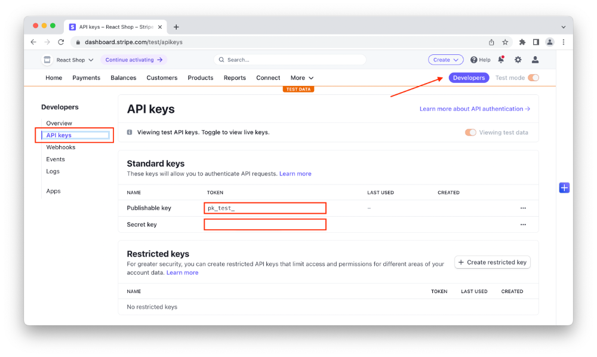
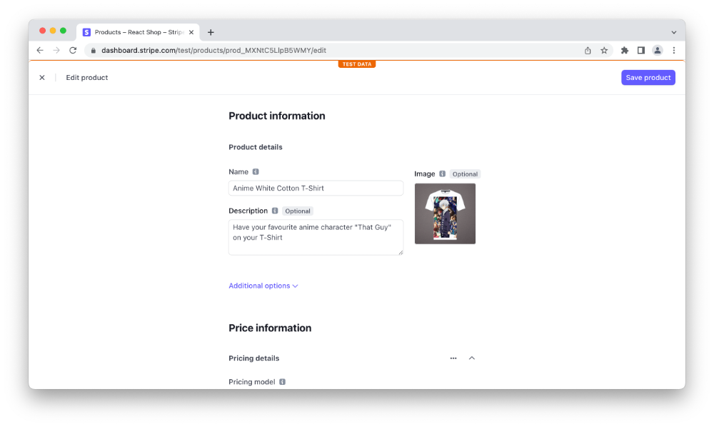

[Continuing with the Next.js & Stripe](https://andrewford.co.nz/articles/shop-nextjs-stripe-introduction/) online shop we will setup your Stripe account. Head to [Stripe's website](https://dashboard.stripe.com/register) and setup a new account.

## Register a Stripe account



Once signed up go to the "Developer" page and select the "API keys" on the left hand side menu.

We need to now create an ENV file for our project so it can use these API keys to retrieve our products from Stripe. In the folder of your project create a new file called `.env.local` and add the following two variable names.

```
NEXT_PUBLIC_STRIPE_PUBLISHABLE_KEY=
STRIPE_SECRET_KEY=
```

Grab the keys from the API keys page and add them to the corresponding variables in the `.env.local` file.

_Please be aware that these keys are for testing and you will need to generate new keys for production._

## Create products for our online shop

You can manage all the content for your online shop through the Stripe dashboard. This has a lot of benefits. You don't requite a CMS to manage your products, you can use different currencies/pricing for different regions and you can manage your product images all in the same interface.

From the menu, access the "Products" page then click the purple "Add Product" button.



Add some details for your product, add a price and upload an image. Make sure to select "One Time" for the product price.


Now repeat until you have finished creating all the new products you wish to create. You should end up with a product list similar to this.


## Setup your shop with the Stripe JS library and get your products
