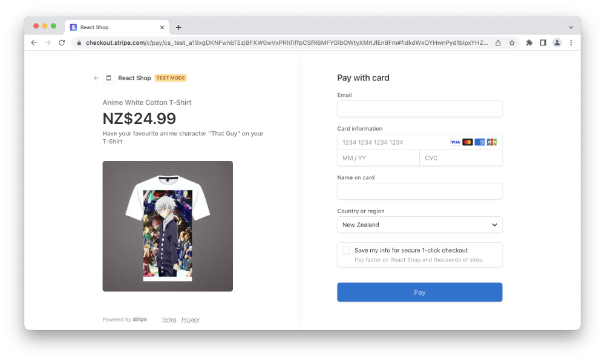
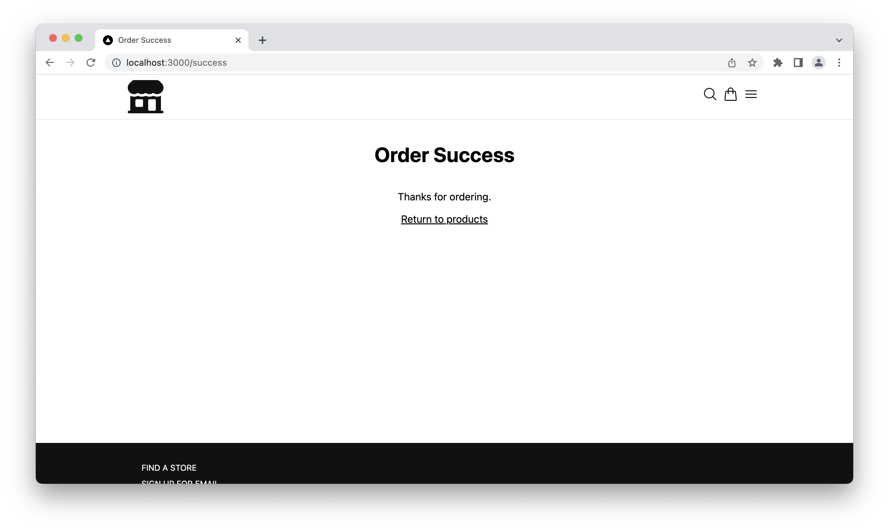
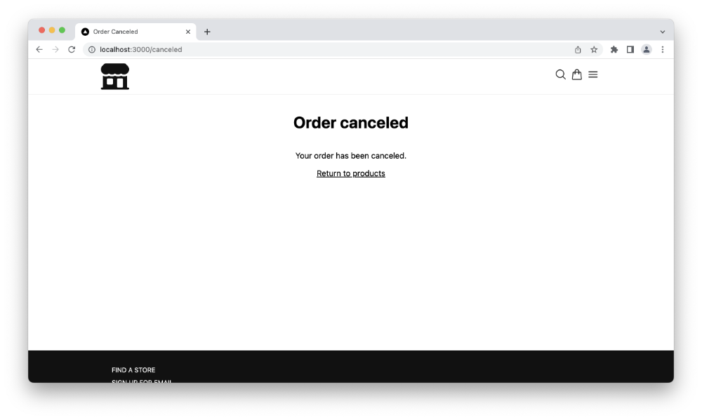



Concluding with the [Next.js & Stripe online shop series](https://andrewford.co.nz/articles/shop-nextjs-stripe-introduction/) we now will configure our shop to be able to purchase via Stripes hosted checkout page.

To do this we need to create a new API router to post the ID of the product we wish to purchase. In the `pages/api/` folder create a new file `checkout_session.js`. Add the following to this file:

```js
const stripe = require("stripe")(process.env.STRIPE_SECRET_KEY);

export default async function handler(req, res) {
  if (req.method === "POST") {
    try {
      // Check priceId has been provided
      if (!req.body?.priceId) {
        throw new Error("Price ID not provided");
      }
      // Create Checkout Sessions from body params.
      const session = await stripe.checkout.sessions.create({
        line_items: [
          {
            // Provide the exact Price ID (for example, pr_1234) of the product you want to sell
            price: req.body.priceId,
            quantity: 1,
          },
        ],
        mode: "payment",
        success_url: `${process.env.HOST}/success`,
        cancel_url: `${process.env.HOST}/canceled`,
      });
      res.redirect(303, session.url);
    } catch (err) {
      res.status(err.statusCode || 500).json(err.message);
    }
  } else {
    res.setHeader("Allow", "POST");
    res.status(405).end("Method Not Allowed");
  }
}
```

This function will only allow POST requests. It also checks to ensure that the request body contains the price ID for the product, before redirecting to Stripe requesting with our private Stripe key.

We now need to update the product component (`products.js`), adding the form with the product price ID to post. See the changes to add below highlighted with a comment.

```jsx
export const Products = ({ products }) => {
  return (
    <>
      {products.length ? (
        <ul className={styles.products}>
          {products.map((product) => (
            <li key={product.id}>
              // Add the form
              <form action="/api/checkout_sessions" method="POST">
                <Image
                  src={product.images[0]}
                  alt={`Image of ${product.name}`}
                  layout={"responsive"}
                  width={0}
                  height={0}
                  priority={true}
                />
                <h2>{product.name}</h2>
                <p>{product.description}</p>
                <button type="submit" role="link" className={styles.link}>
                  Buy Now
                </button>
                <input
                  type="hidden"
                  name="priceId"
                  value={product.default_price}
                />
              </form>
              // end form
            </li>
          ))}
        </ul>
      ) : (
        <div>No products</div>
      )}
    </>
  );
};
```

In the last step, we need to add the Stripe front-end library which generates a new shopping object. Let's first install via the terminal:

```shell
npm install --save @stripe/stripe-js
```

Once that's been added we can then add the following to the `index.js` file to create a Stripe object. Make sure it sits outside the component for the page.

```js
// Make sure to call `loadStripe` outside of a component’s render to avoid
// recreating the `Stripe` object on every render.
const stripePromise = loadStripe(
  `${process.env.NEXT_PUBLIC_STRIPE_PUBLISHABLE_KEY}`
);
```

We now need to create the following pages `success.js` and `canceled.js` to be added to the `pages` folder.

The `success.js` file will have the following:

```jsx
import Head from "next/head";
import Link from "next/link";
import { Layout } from "../components/layout";

export default function Success() {
  return (
    <>
      <Head>
        <title>Order Success</title>
        <meta name="description" content="Products" />
      </Head>
      <Layout>
        <h1>Order Success</h1>
        <p>Thanks for ordering.</p>

        <Link href="/">Return to products</Link>
      </Layout>
    </>
  );
}
```

The `canceled.js` will have the following:

```jsx
import Head from "next/head";
import Link from "next/link";
import { Layout } from "../components/layout";

export default function Canceled() {
  return (
    <>
      <Head>
        <title>Order Canceled</title>
        <meta name="description" content="Products" />
      </Head>
      <Layout>
        <h1>Order canceled</h1>
        <p>Your order has been canceled.</p>
        <Link href="/">Return to products</Link>
      </Layout>
    </>
  );
}
```

In the `checkout_session.js` file we supply a `success_url` and a `canceled_url` value. This is where we redirect the user from the checkout page.

When you click on the "Buy Now" button you will be redirected to the Stripe checkout like in the image below.



If you complete the purchase, then you will be directed to the success page.



Otherwise if you click the left arrow / back you will be redirected to the cancel page.



We have now completed the display of products and have the checkout page working correctly. Well done. 👏

You can [checkout the GitHub repository](https://github.com/andrewjamesford/shop-nextjs-stripe) for this project to see the finished result. Please note there are branches for each step. Alternatively you can view the repository on [CodeSandbox](https://codesandbox.io/p/github/andrewjamesford/shop-nextjs-stripe/main?file=%2FREADME.md).

For more help with setting up Stripe checkout take a look at the [documentation](https://stripe.com/docs/checkout/quickstart) on the Stripe website.




