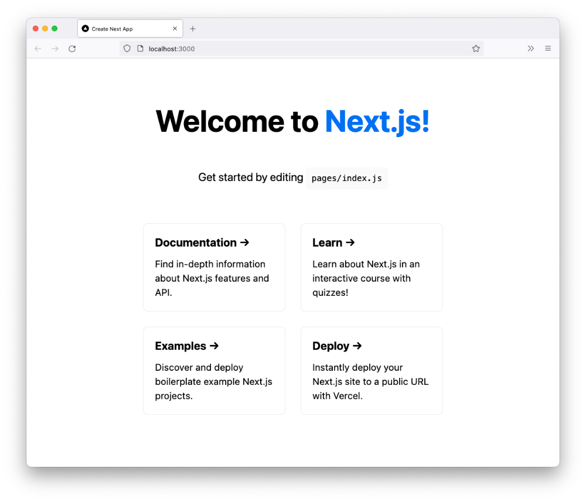

In this series I'm going to walk through the process of building an online shop using the [React](https://reactjs.org) Framework [Next.js](https://nextjs.org).You may have built a website before using the likes of [Create React App](https://create-react-app.dev) which will get you the barebones together to start building. It doesn't get you that far before you have a huge amount of decisions to make. What routing should I use for my pages? What CSS in JS library? Should I use Tailwind? Very quickly you can be overloaded with decisions. This stems mostly from the fact that React is not a framework. It's a library.

Next.js on the other hand is "The React Framework for Production". With it a lot of the decisions have been made for you, letting you get up and running much faster. More importantly it solves a lot of the common problems that building a website/web app entail.

You will need to have an understanding of HTML, CSS and React of course to follow along with this series. I teach all these subjects on the Client Side paper at [Developers Institute](https://www.developers.ac.nz) 😉

To get started building a Next.js application, hopefully you have Node installed (if not [download here](https://nodejs.org/en/) and open up your terminal.

```shell
npx create-next-app@latest
```

Follow the prompt and give it a name "shop-nextjs-stripe"

Now head into the directory with your new project and start the local development .

```shell
cd shop-nextjs-stripe
npm run dev
```

Open your code editor and take a look at the folder structure. You will see 3 folders. The "pages" folder is where the routing happens. That will direct the url in your app for example if you had a file called `contact-us.js` so when in your browser you head to `http://localhost:3000/contact-us` the content from that component.

Your **pages** folder will have a **api** folder and two files `_app.js` and `index.js`.

Open the project in a [browser](http://localhost:3000) and you should see something like this



Great so now the project is up and running in development mode 🙌

In your code editor we will now open the `index.js` file in the `pages` folder.

We are going to remove everything and replace it with the following:

```jsx
import Head from "next/head";

export default function Home() {
  return (
    <>
      <Head>
        <title>Products</title>
        <meta name="description" content="Products" />
      </Head>
    </>
  );
}
```

That's cleared the standard install junk. Time to make our first component. Let's make a new folder called `components` and add a file `layout.js` in that directory. Add the following:

```jsx
import React from "react";
import Head from "next/head";

import styles from "../styles/layout.module.css";

export const Layout = ({ children }) => {
  return (
    <>
      <Head>
        <link rel="icon" href="/favicon.ico" />
      </Head>
      <div className={styles.container}>
        <main className={styles.main}>{children}</main>
      </div>
    </>
  );
};
```

This will be the layout shared across all our pages in the shop. To add to that we will add a Header and a Footer component.

Again in the `components` folder create a `header.js` and a `footer.js` file.

In the header file add the following:

```jsx
import React from "react";

export const Header = () => {
  return <header></header>;
};
```

In the footer file add the following:

```jsx
import React from "react";

export const Footer = () => {
  return <footer></footer>;
};
```

Now we need to update the layout component like so (see the comments in the code):

```jsx
import React from "react";
import Head from "next/head";

// Add the following imports
import { Header } from "./header";
import { Footer } from "./footer";

import styles from "../styles/layout.module.css";

export const Layout = ({ children }) => {
  return (
    <>
      <Head>
        <link rel="icon" href="/favicon.ico" />
      </Head>
      {/* Add the Header */}
      <Header />
      <div className={styles.container}>
        <main className={styles.main}>{children}</main>
      </div>
      {/* Add the Footer */}
      <Footer />
    </>
  );
};
```

We now have a Layout component we can re-use throughout our application with the Header and Footer on every page. We can pass the content for the page via the **children** prop.

You may have noticed we have a reference to a CSS module but haven't added that to the `styles` folder yet. By default Next.js supportes CSS modules, the major benefit with CSS modules is we can avoid CSS name colisions (it makes unique CSS class names) and feel comfortable to delete an unused CSS file as we know it's only relavent to one component. [CSS Tricks](https://css-tricks.com/css-modules-part-1-need/) has a series on CSS Modules worth reading to get a better understanding.

Notice that the coresponding CSS classes above are referenced as a JavaScript object e.g.

```jsx
<div className={styles.container}>
```

Let's add the CSS and it's file. Create a `layout.module.css` file in the `styles` folder with the following code:

```css
.container {
  min-height: 90vh;
  display: flex;
  flex-direction: column;
  justify-content: flex-start;
}
.main {
  padding: 5.3rem 0 1rem 0;
  margin: 0;
  flex: 1;
  display: flex;
  flex-direction: column;
  align-items: center;
}
```

Now we can add the Layout component to every page. Let's add it to the `index.js`:

```js
import Head from "next/head";
import styles from "../styles/Home.module.css";

// Import the layout components
import { Layout } from "../components/layout";

export default function Home() {
  return (
    <>
      <Head>
        <title>Products</title>
        <meta name="description" content="Products" />
      </Head>

      {/* Add the Layout component to the Home page. */}
      <Layout></Layout>
    </>
  );
}
```

Now we can start putting some content in to the Header component. Let's start off by adding some `<div>` tags to store a logo and some icons.

```jsx
import React from "react";

import styles from "../styles/header.module.css";

export const Header = () => {
  return (
    <header className={styles.header}>
      <div className={styles.mainNav}>
        <div className={styles.logo}></div>
        <div className={styles.iconNav}>
          <nav></nav>
        </div>
      </div>
    </header>
  );
};
```

And the subsequent CSS styles

```css
.header {
  width: 100%;
  height: 4.4rem;
  border-bottom: 1px solid #eaeaea;
  display: flex;
  justify-content: center;
  align-items: center;
  position: fixed;
  background-color: var(--bg-color);
  z-index: 10;
}
.iconNav {
  margin-top: 0.8rem;
}
.mainNav {
  display: flex;
  justify-content: space-between;
  width: 100%;
  max-width: var(--max-cont-width);
}
.logo {
  color: var(--font-color);
  cursor: pointer;
  width: 4rem;
  height: 4rem;
}
```

We also need to update the `global.css` file with these variables. Add them to the very top of the file.

```css
:root {
  --font-color: #111;
  --icon-color: #111;
  --bg-color: #fff;
  --max-cont-width: 63rem;
}
```

Now lets add some icons, we are going to use [Heroicons](https://heroicons.com) in this project. In the terminal run:

```shell
npm i @heroicons/react
```

We can now add them to the `header.js` file like so. Also note that I've now added an SVG for a logo.

```jsx
import React from "react";
import {
  SearchIcon,
  ShoppingCartIcon,
  MenuIcon,
} from "@heroicons/react/outline";

import styles from "../styles/header.module.css";

export const Header = () => {
  return (
    <header className={styles.header}>
      <div className={styles.mainNav}>
        <svg
          className={styles.logo}
          height="32px"
          version="1.1"
          viewBox="0 0 32 32"
          width="32px"
          xmlns="http://www.w3.org/2000/svg"
        >
          <title />
          <desc />
          <defs />
          <g
            fill="none"
            fillRule="evenodd"
            id="Page-1-Copy"
            stroke="none"
            strokeWidth="1"
          >
            <g fill="#000000" id="icon-48-sports-shoe">
              <path
                d="M12.3999996,12.6453372 L12.9004905,13.4146232 C12.759157,13.5244874 12.6200677,13.6326057 12.4831348,13.7375719 L11.9382174,12.8999996 L11.1000004,13.4453365 L11.6736554,14.3270802 C11.5220912,14.4288833 11.3732771,14.5223259 11.227069,14.6051021 L10.6382172,13.6999998 L9.80000019,14.2453367 L10.2753895,14.9760399 C10.1825324,14.9917642 10.0907515,15 10,15 C8,14.9999999 7.00544417,15 7.00544417,15 C5.34558319,15 4,16.3496704 4,18.0092545 C4,20.2132824 5.79793835,22 8.00281647,22 L26.9964051,22 C28.10296,22 29.0104668,21.0998238 29.0049515,20.007983 C29.0049515,20.007983 29.2791748,11 27,11 C24.7208252,11 25,12.9714355 22,12.9714355 C19,12.9714355 19.5,11 18,11 C16.8711405,11 15.8463075,11.4161057 14.908725,11.9799029 L14.4191085,11.2273316 L13.5808915,11.7726684 L14.0736778,12.5301119 C13.9463245,12.6205345 13.8206687,12.7123155 13.6966604,12.8046572 L13.2382166,12.1000004 L12.3999996,12.6453372 Z M27.861749,15.5996176 C27.9379008,16.3923181 27.9821587,17.2106587 28.0024589,18 L22,18 C20.0825253,18 19.5,18 17.4805014,18.2636385 C17.4564519,18.1145188 17.4078454,17.947657 17.3222136,17.7763932 C17.0840689,17.3001039 16.6339131,17 16,17 L10.5,17 C9.82141316,17 9.42781896,16.7376039 9.19721361,16.2763932 C9.15098062,16.1839272 9.11429063,16.0903772 9.08572384,16 C9.33299718,16 9.63129724,16 9.99999996,16 C10.2862572,16 10.5673495,15.9540283 10.8533177,15.8643518 L11.2936525,16.5411741 L12.1318695,15.9958372 L11.7734086,15.4448604 C11.8965787,15.3733653 12.0222159,15.2952148 12.1509688,15.2105554 C12.1735931,15.1956792 12.196274,15.1806332 12.2190528,15.1653902 L12.5936527,15.7411739 L13.4318697,15.195837 L13.0300563,14.5782246 C13.0516745,14.5617275 13.0735804,14.5449699 13.0957895,14.5279406 C13.1432609,14.4915408 13.285136,14.3815646 13.4476508,14.2556429 L13.893652,14.9411746 L14.7318689,14.3958378 L14.2432575,13.6448113 C14.3720116,13.5487433 14.4975255,13.4571772 14.6201262,13.3700373 L15.0745439,14.0685058 L15.9127608,13.523169 L15.45487,12.819362 C15.5607868,12.7557451 15.6647467,12.6960261 15.7670375,12.6401385 L15.7906087,12.6884744 C15.7906087,12.6884744 16.4002393,13.6073461 16.8964466,14.1035534 C18.0790416,15.2861484 19.6087236,16 21.5,16 C23.3411912,16 25.0164813,15.5072676 26.4928215,14.6870786 C26.8773636,14.4734441 27.5068097,14.0409629 27.6220108,13.95044 C27.728602,14.4378552 27.8033416,14.9916282 27.861749,15.5996176 Z M28.0159223,18.9642382 C28.0165574,19.2347461 28.014546,19.4986342 28.0102517,19.7533976 C28.0083957,19.8635085 28.0065697,19.9396088 28.0054145,19.9775548 C28.0076649,20.547674 27.5516073,21 26.9964051,21 L8.00281647,21 C7.11411316,21 6.31422081,20.6132976 5.76388989,20.0000001 L13,20 C14.4093234,20 15.3913658,19.6736493 17.3032466,19.3435373 C19.5,18.9642382 20.8656616,18.9642382 22,18.9642382 L28.0159223,18.9642382 L28.0159223,18.9642382 Z M5.16939242,19 C5.05969446,18.6897853 5,18.3563194 5,18.0092545 C5,16.9007272 5.89909525,16 7.00544418,16 C7.04065746,16 7.04065746,16 7.21692887,16 C7.57792029,15.9999999 7.78598766,15.9999999 8.05270437,15.9999999 C8.14432866,16.3424883 8.257124,16.632282 8.30278643,16.7236068 C8.69718112,17.5123961 9.42858691,18 10.5,18 L16,18 C16.2410868,18 16.353431,18.0748961 16.4277864,18.2236068 C16.4805851,18.3292042 16.5,18.4456936 16.5,18.5 C15.1790149,18.8462025 14.1739435,19 13,19 L5.16939242,19 L5.16939242,19 L5.16939242,19 Z M18,12 C18.1281581,12 18.1573083,12.0179121 18.3443391,12.2387492 C18.3311836,12.2232158 18.5955384,12.5435656 18.6896412,12.6495756 C19.4672467,13.525575 20.428428,13.9714355 22,13.9714355 C23.5222433,13.9714355 24.4064013,13.592566 25.4113426,12.753231 C25.4568265,12.7152425 25.5249661,12.6577355 25.6285801,12.5704234 C26.1628308,12.1225726 26.4241298,12 27,12 C26.9817976,12 27.1365427,12.1809634 27.3306727,12.7370769 C27.4412776,13.0539203 27.413071,12.9547294 27.413071,12.9547294 C27.413071,12.9547294 27.113107,13.0941784 27.0945132,13.1082151 C26.7763191,13.3484227 26.4129123,13.5875137 26.0071785,13.8129214 C24.6710187,14.5552324 23.1588088,15 21.5,15 C19.8912764,15 18.6084584,14.4013516 17.6035534,13.3964466 C17.2843253,13.0772185 16.7926102,12.3950292 16.7926102,12.3950292 L16.6714137,12.2314116 C17.1217139,12.0747506 17.5542829,12 18,12 Z"
                id="sports-shoe"
              />
            </g>
          </g>
        </svg>
        <div className={styles.iconNav}>
          <nav>
            <ul>
              <li>
                <SearchIcon className={styles.searchIcon} />
              </li>
              <li>
                <ShoppingCartIcon className={styles.cartIcon} />
              </li>
              <li>
                <MenuIcon className={styles.menuIcon} />
              </li>
            </ul>
          </nav>
        </div>
      </div>
    </header>
  );
};
```

Plus the add corresponding CSS for the icons.

```css
.searchIcon {
  width: 1.5em;
  height: 1.5em;
  color: var(--icon-color);
  margin-right: 0.5rem;
}
.cartIcon {
  width: 1.5em;
  height: 1.5em;
  color: var(--icon-color);
  margin-right: 0.5rem;
}
.menuIcon {
  width: 1.5em;
  height: 1.5em;
  color: var(--icon-color);
  margin-right: 0.5rem;
}
```

we are almost done, lets add a footer and style it.

```jsx
import React from "react";
import styles from "../styles/footer.module.css";

export const Footer = () => {
  return (
    <footer className={styles.footer}>
      <div className={styles.footerCont}>
        <nav className={styles.footerNav}>
          <ul>
            <li>Find a Store</li>
            <li>Sign up for Email</li>
            <li>Become a Member</li>
            <li>Feedback</li>
          </ul>
        </nav>
        <div className={styles.copyright}>&copy; 2021 Shoe Shop</div>
      </div>
    </footer>
  );
};
```

Add a new file to the styles folder `footer.module.css`. Then add the following CSS.

```css
.footer {
  width: 100%;
  height: 11rem;
  display: flex;
  justify-content: center;
  align-items: center;
  background-color: var(--font-color);
  color: #fff;
  flex-direction: column;
}
.footerCont {
  max-width: var(--max-cont-width);
  margin: 0 auto;
  padding: 0 1.6rem;
  width: 100%;
}
.footerNav ul {
  display: flex;
  flex-direction: column;
  list-style: none;
  margin: 0;
  padding: 0;
}
.footerNav li {
  padding: 0.3rem 0;
  text-transform: uppercase;
  font-size: 0.8em;
}
.copyright {
  font-size: 0.8em;
  opacity: 0.8;
  margin-top: 0.6rem;
}
```

Alright that's quite a bit we've done here 👍. We now have the shell off the shop. Next up we need to set up Stripe to store our product info, product images and prices.
