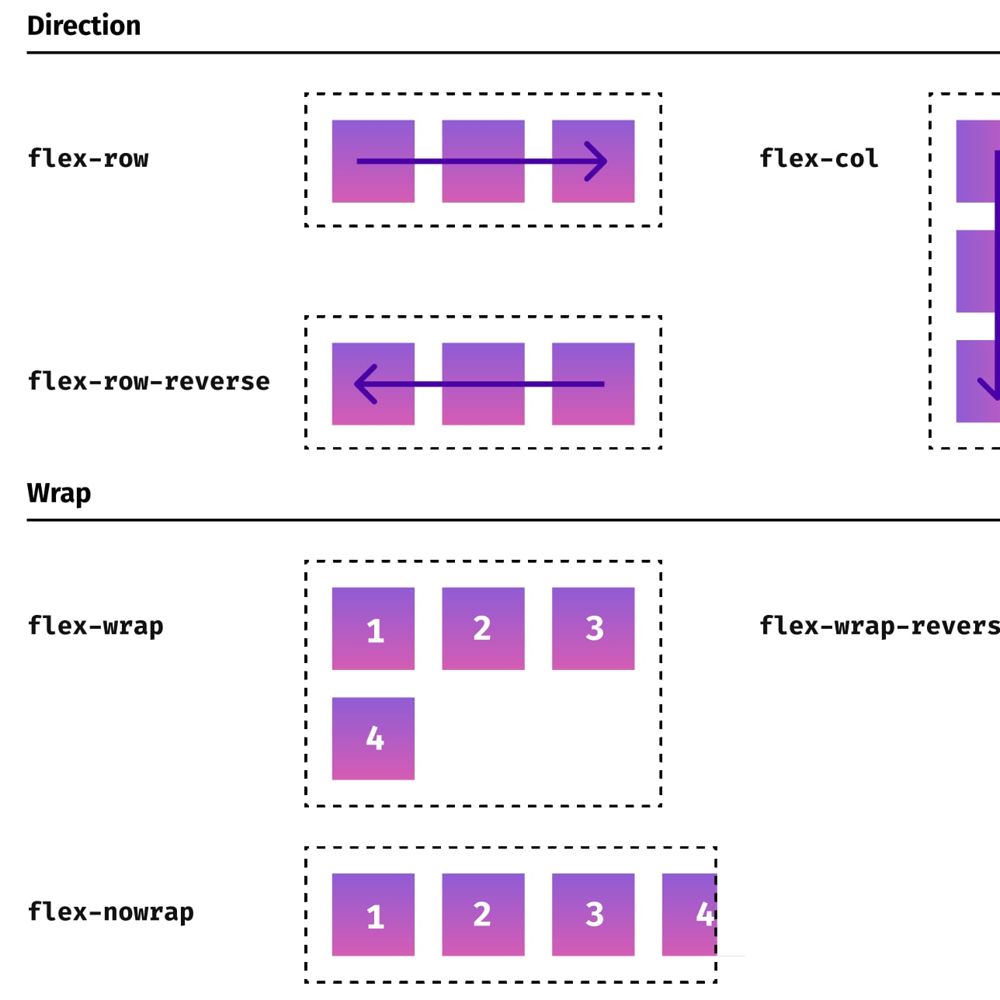

If you hadn't figured out already (see my other [blog entry](https://andrewford.co.nz/articles/tailwind-theming-by-config/)) I'm quite a fan of [Tailwind](https://tailwindcss.com/) the utility CSS framework. While I think their documentation is great, I'm a fan of visual cheatsheets. With a heavy emphasis on the visual. Finding no one else had made what I wanted I fired up [Figma](https://figma.com) and got to work.

Hope you like it! Any suggestions [let me know](mailto:me@andrewford.co.nz).

## Update 21 May 2022

I've added a new PDF for version 3 of Tailwind CSS.

It has the following changes:

- Changed `flex-grow` to `grow`
- Changed `flex-shrink` to `shrink`
- Added `basis-{size}` with two examples


