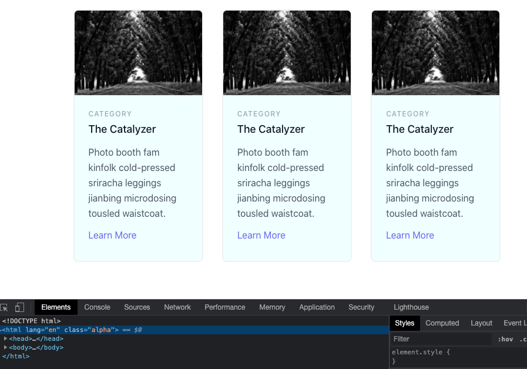
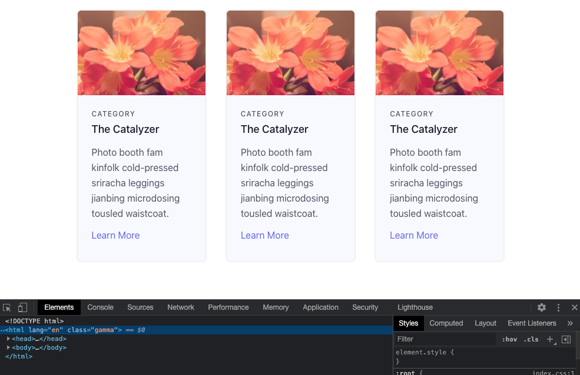

---
title: Tailwind Theming by Config
date: '2021-04-06T21:47:02Z'
template: post
draft: true
slug: 'tailwind-theming-by-config'
category: article
tags:
- 
description: Description here
--- 

A common approach to building web apps in large organisations are theming them for multiple brands. The app will function in the same way but look different for each corresponding theme with alternate fonts, colours and logo etc. This can be a big headache, and you can be left maintaining multiple copies of the same code base. In an ideal world we don't want to do that.

I found myself at work in this exact scenario. We had a need for multiple themes/branding but at the apps core it had the same functionality. I needed to use the same code base for this ReactJS app. Most importantly I needed to have flexibility and have options to hide and show form fields, components etc if needed for different themes. I also wanted to have an easy way to switch which theme/brand the app was using across the board at the deployment level. So same GIT repository, 3 different deployments (domains), all hosted on Azure.

At work we use [Tailwind CSS](https://tailwindcss.com) which is a utility first CSS framework. Rather than making custom CSS classes for each part of a component you are working on, you add multiple utility classes to each element and never run the issue of another developer (or your self in the future) breaking your design. CSS classes stay consistent and in practise I've found you only need to add on the off occasion a custom CSS class.


To achieve the theming of Tailwind I used a plugin called [tailwind-theme-variants](https://github.com/JakeNavith/tailwindcss-theme-variants). This allowed me to create 3 variants. We will call them Alpha, Beta, Gamma. Each have there own brand colours. So anywhere through out the application I can prefix the brand name and a colon to a CSS class for example and know it will only be shown for that theme. Just like when using the [responsive classes in Tailwind CSS](https://tailwindcss.com/docs/responsive-design).

```jsx
<div className="alpha:bg-alpha-color1 beta:bg-beta-color1 gamma:bg-gamma-color1 text-sm">
My component
</div>
```

In the [example](https://github.com/andrewjamesford/tailwind-theming-by-config-example) above when the user is looking at the **alpha** themed version of the app this component will have the background colour of alpha colour 1 (**<span style="color:azure">azure</span>**). Versus the **gamma** themed version will have the background colour of gamma colour 1 (**<span style="color:ghostwhite">ghostwhite</span>**). This allows some great flexibility to theme your app while at the same time making it easy to manage.

## Final result

First off lets look at the final results. In the screenshots below you can see two identically styled designs of 3 cards. The top one has the **alpha** theme with a background color of **<span style="color:azure">azure</span>** the bottom **gamma** with a background colour of **<span style="color:ghostwhite">ghostwhite</span>**.


*The alpha theme is set*


*The gamma theme is set*

Same code base, the only difference between each to get the different results is that an environment variable is different between the two. In this case while developing I have a *.env* file that looks like this: 

```properties
REACT_APP_THEME_CONFIG=alpha
```
The above sets the theme to alpha on build via an [environment variable](https://en.wikipedia.org/wiki/Environment_variable).

## Getting started

To set up your own theme variants for your own Tailwind application we need to first install the plugin:

```shell
npm install --save-dev tailwindcss-theme-variants
```

We now need to modify our [*tailwind.config.js*](https://github.com/andrewjamesford/tailwind-theming-by-config-example/blob/main/tailwind.config.js) file. Add the following at the top.

```js
const { themeVariants } = require("tailwindcss-theme-variants");
```

We can then add our custom theme colors for our individual themes in this case alpha, beta and gamma:
```js
theme: {
    extend: {
      colors: {
			alpha: {
				colour1: 'azure',
					
			},
			beta: {
				colour1: 'green',
					
			},
            gamma: {
				colour1: 'ghostwhite',					
			},
      }
    },
  },
```

Followed by our variants, which set what properties we can use these colours for in this example background color, border color and text color. I used a group called 'schemes' in this example to not have to write each theme name 9 times:
```js
variants: {
    backgroundColor: ['schemes'],
    borderColor: ['schemes'],
    textColor: ['schemes'],
    extend: {},
  },
```

Finally the selector for each theme.
```js
plugins: [
    themeVariants({
      group: "schemes",
      themes: {
          alpha: {
              selector: ".alpha",
          },
          beta: {
              selector: ".beta",
          },
          gamma: {
            selector: ".gamma",
        },
      },
    }),
  ],
```


## How it works

These themes are configured by the root html element having the theme CSS name. In the example below the html tag has the prefix class of Alpha.

```html
<html class="alpha">
...
</html>
```

Coming back to my scenario above I needed the same source code to have the ability to use the same codebase but have different themes for separate deployments.

```html
<html lang="en" class="%REACT_APP_THEME_CONFIG%">
```

The react app here has had the [environment variable set in **index.html**](https://create-react-app.dev/docs/adding-custom-environment-variables/#referencing-environment-variables-in-the-html) file. The variable has been set to **alpha** in the **.env** file. See my [example project](https://github.com/andrewjamesford/tailwind-theming-by-config-example) to get a better understanding of how it works.