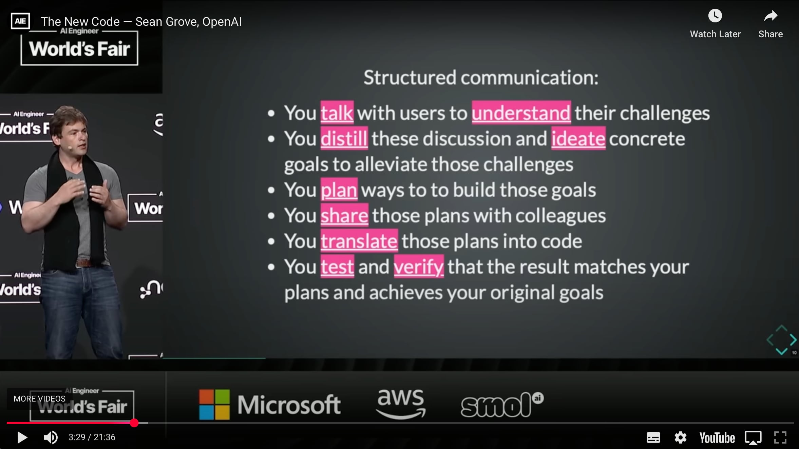

As I continue to use AI more in my side projects, my understanding of what code is and its value is drastically changing. I wholeheartedly believe that the code that I have written for the last 25 years is just a byproduct. For so long, developers and businesses have held it on a pedestal. It is the precious output, the gold to be mined and refined. We felt compelled to protect it at all costs, to back it up, version control it, and guard it jealously.

> We were *wrong*. The valuable artefact is the **structured communication**.

[Sean makes great points in this video](https://youtube.com/watch?v=8rABwKRsec4). As the code can instead be generated by AI, structured forms of communication have much more value for the future. **The skill to learn now is to write better.**
